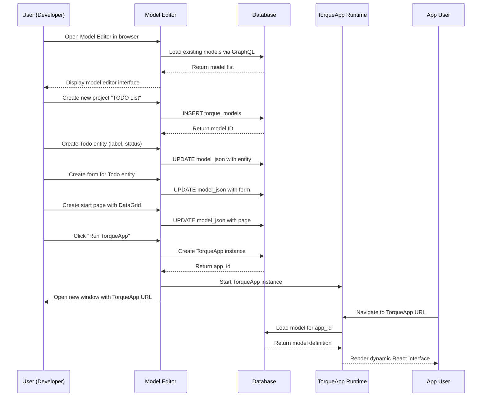
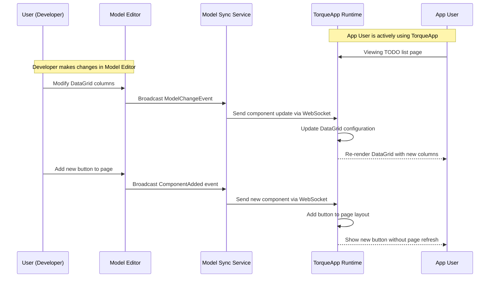
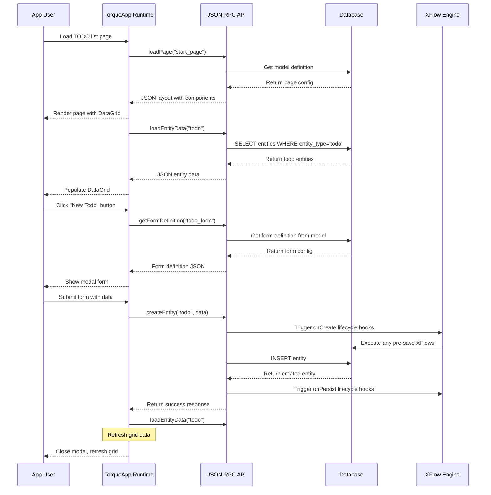
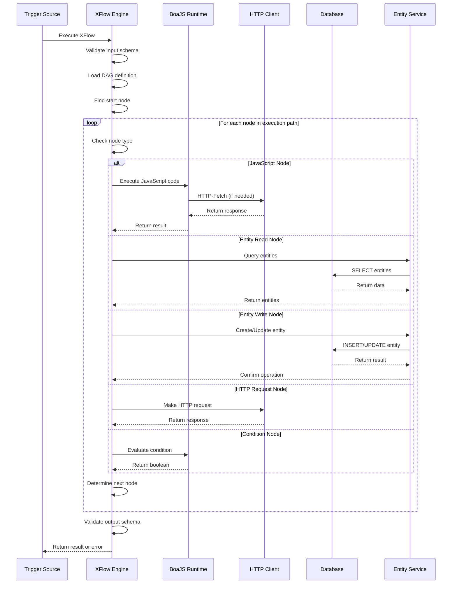
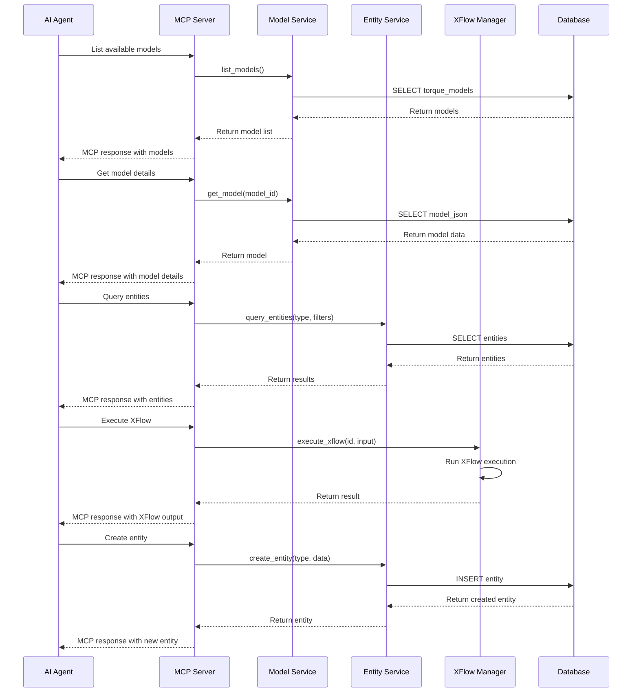
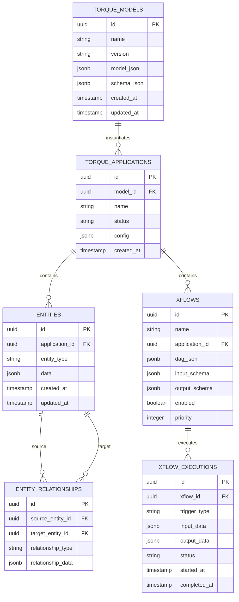
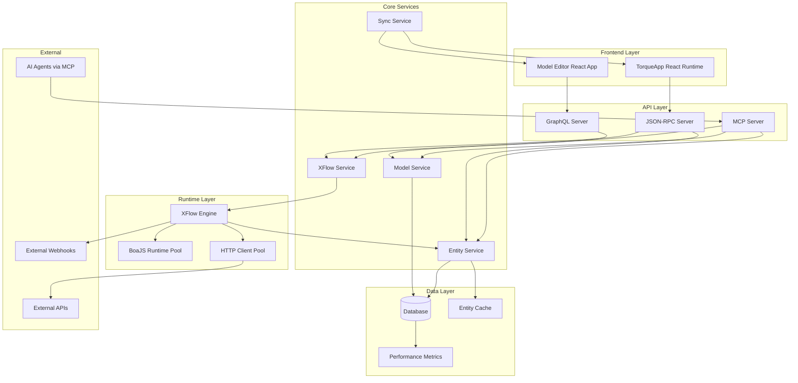

# Torque Implementation Specification

## Architecture Overview

The Torque platform is a high-performance, self-contained Rust binary that serves as a comprehensive application development and runtime platform. It consists of four main components optimized for speed:

1. **Core Server** - Self-contained Rust binary with database integration
2. **Model Editor** - GraphQL-based web interface for designing models
3. **TorqueApp Runtime** - JSON-RPC driven dynamic frontend
4. **XFlow Engine** - Lightweight DAG-based workflow system with BoaJS JavaScript execution

## Technology Stack & Library Selections

### Backend (Rust)
```toml
[dependencies]
# Core runtime
tokio = { version = "1.0", features = ["full"] }
axum = "0.7"
tower = "0.4"
tower-http = { version = "0.5", features = ["cors", "trace"] }

# MCP API integration
axum-mcp = { git = "https://github.com/michiel/axum-mcp", branch = "main" }

# Database (optimized for speed)
sea-orm = { version = "0.12", features = ["sqlx-postgres", "sqlx-sqlite", "runtime-tokio-rustls", "macros"] }
sqlx = { version = "0.7", features = ["runtime-tokio-rustls", "postgres", "sqlite"] }

# Serialization (fast JSON)
serde = { version = "1.0", features = ["derive"] }
serde_json = "1.0"
simd-json = "0.13" # SIMD-accelerated JSON parsing for performance
uuid = { version = "1.0", features = ["v4", "serde"] }

# APIs
async-graphql = "7.0"
async-graphql-axum = "7.0"
jsonrpc-core = "18.0"
jsonrpc-http-server = "18.0"

# JavaScript Engine (lightweight and fast)
boa_engine = "0.17"
boa_runtime = "0.17"

# Validation (fast schema validation)
jsonschema = "0.17"
validator = { version = "0.16", features = ["derive"] }

# HTTP client for webhooks (performance optimized)
reqwest = { version = "0.11", features = ["json", "rustls-tls"] }

# Cron scheduling
tokio-cron-scheduler = "0.10"

# Logging and monitoring (low overhead)
tracing = "0.1"
tracing-subscriber = { version = "0.3", features = ["env-filter", "json"] }
opentelemetry = "0.21"

# Asset embedding
rust-embed = "8.0"

# Performance optimizations
dashmap = "5.5" # Lock-free concurrent hashmap
parking_lot = "0.12" # Faster mutex implementation
mimalloc = "0.1" # Fast allocator
```

### Frontend (React)
```json
{
  "dependencies": {
    "react": "^18.2.0",
    "react-dom": "^18.2.0",
    "typescript": "^5.0.0",
    "@apollo/client": "^3.8.0",
    "graphql": "^16.8.0",
    "react-router-dom": "^6.8.0",
    "@mantine/core": "^7.0.0",
    "@mantine/hooks": "^7.0.0",
    "@mantine/form": "^7.0.0",
    "reactflow": "^11.10.0",
    "@monaco-editor/react": "^4.6.0",
    "react-i18next": "^13.0.0",
    "@tanstack/react-query": "^4.29.0",
    "react-hook-form": "^7.45.0",
    "zod": "^3.22.0"
  }
}
```

## Data Model (Performance Optimized)

### Core Database Schema

```sql
-- =============================================
-- Core Model Management
-- =============================================

-- Torque Models (design-time artifacts)
CREATE TABLE torque_models (
    id UUID PRIMARY KEY DEFAULT gen_random_uuid(),
    name VARCHAR(255) NOT NULL,
    description TEXT,
    version VARCHAR(50) NOT NULL DEFAULT '1.0.0',
    model_json JSONB NOT NULL,
    schema_json JSONB NOT NULL,
    created_at TIMESTAMP WITH TIME ZONE DEFAULT NOW(),
    updated_at TIMESTAMP WITH TIME ZONE DEFAULT NOW(),
    UNIQUE(name, version)
);

-- Indexes for fast model retrieval
CREATE INDEX idx_torque_models_name ON torque_models(name);
CREATE INDEX idx_torque_models_created_at ON torque_models(created_at DESC);
CREATE INDEX CONCURRENTLY idx_torque_models_model_json_gin ON torque_models USING GIN (model_json);

-- Model version history (partitioned for performance)
CREATE TABLE torque_model_versions (
    id UUID PRIMARY KEY DEFAULT gen_random_uuid(),
    model_id UUID NOT NULL REFERENCES torque_models(id) ON DELETE CASCADE,
    version VARCHAR(50) NOT NULL,
    model_json JSONB NOT NULL,
    schema_json JSONB NOT NULL,
    created_at TIMESTAMP WITH TIME ZONE DEFAULT NOW(),
    created_by VARCHAR(255),
    UNIQUE(model_id, version)
) PARTITION BY RANGE (created_at);

-- Create partitions for model versions (monthly)
CREATE TABLE torque_model_versions_2024 PARTITION OF torque_model_versions
    FOR VALUES FROM ('2024-01-01') TO ('2025-01-01');

-- =============================================
-- Application Runtime (Optimized for Speed)
-- =============================================

-- TorqueApp instances (runtime applications)
CREATE TABLE torque_applications (
    id UUID PRIMARY KEY DEFAULT gen_random_uuid(),
    model_id UUID NOT NULL REFERENCES torque_models(id),
    name VARCHAR(255) NOT NULL,
    status VARCHAR(50) NOT NULL DEFAULT 'active',
    config JSONB NOT NULL DEFAULT '{}',
    created_at TIMESTAMP WITH TIME ZONE DEFAULT NOW(),
    updated_at TIMESTAMP WITH TIME ZONE DEFAULT NOW(),
    UNIQUE(name)
);

CREATE INDEX idx_torque_applications_status ON torque_applications(status) WHERE status = 'active';
CREATE INDEX idx_torque_applications_model_id ON torque_applications(model_id);

-- Universal entity storage (optimized for high-speed access)
CREATE TABLE entities (
    id UUID PRIMARY KEY DEFAULT gen_random_uuid(),
    application_id UUID NOT NULL REFERENCES torque_applications(id) ON DELETE CASCADE,
    entity_type VARCHAR(255) NOT NULL,
    data JSONB NOT NULL,
    created_at TIMESTAMP WITH TIME ZONE DEFAULT NOW(),
    updated_at TIMESTAMP WITH TIME ZONE DEFAULT NOW()
) PARTITION BY HASH (application_id);

-- Create hash partitions for entities (8 partitions for load distribution)
CREATE TABLE entities_0 PARTITION OF entities FOR VALUES WITH (MODULUS 8, REMAINDER 0);
CREATE TABLE entities_1 PARTITION OF entities FOR VALUES WITH (MODULUS 8, REMAINDER 1);
CREATE TABLE entities_2 PARTITION OF entities FOR VALUES WITH (MODULUS 8, REMAINDER 2);
CREATE TABLE entities_3 PARTITION OF entities FOR VALUES WITH (MODULUS 8, REMAINDER 3);
CREATE TABLE entities_4 PARTITION OF entities FOR VALUES WITH (MODULUS 8, REMAINDER 4);
CREATE TABLE entities_5 PARTITION OF entities FOR VALUES WITH (MODULUS 8, REMAINDER 5);
CREATE TABLE entities_6 PARTITION OF entities FOR VALUES WITH (MODULUS 8, REMAINDER 6);
CREATE TABLE entities_7 PARTITION OF entities FOR VALUES WITH (MODULUS 8, REMAINDER 7);

-- High-performance indexes for entities
CREATE INDEX idx_entities_app_type ON entities(application_id, entity_type);
CREATE INDEX CONCURRENTLY idx_entities_data_gin ON entities USING GIN (data);
CREATE INDEX idx_entities_updated_at ON entities(updated_at DESC);

-- Entity relationships (optimized for fast lookups)
CREATE TABLE entity_relationships (
    id UUID PRIMARY KEY DEFAULT gen_random_uuid(),
    source_entity_id UUID NOT NULL REFERENCES entities(id) ON DELETE CASCADE,
    target_entity_id UUID NOT NULL REFERENCES entities(id) ON DELETE CASCADE,
    relationship_type VARCHAR(255) NOT NULL,
    relationship_data JSONB DEFAULT '{}',
    created_at TIMESTAMP WITH TIME ZONE DEFAULT NOW(),
    
    UNIQUE(source_entity_id, target_entity_id, relationship_type)
);

-- Bidirectional relationship indexes for fast traversal
CREATE INDEX idx_entity_relationships_source ON entity_relationships(source_entity_id, relationship_type);
CREATE INDEX idx_entity_relationships_target ON entity_relationships(target_entity_id, relationship_type);

-- =============================================
-- XFlow Workflow Engine (Lightweight & Fast)
-- =============================================

-- XFlow definitions (optimized for quick execution)
CREATE TABLE xflows (
    id UUID PRIMARY KEY DEFAULT gen_random_uuid(),
    name VARCHAR(255) NOT NULL,
    description TEXT,
    application_id UUID REFERENCES torque_applications(id) ON DELETE CASCADE,
    dag_json JSONB NOT NULL,
    input_schema JSONB NOT NULL,
    output_schema JSONB NOT NULL,
    error_schema JSONB NOT NULL,
    version VARCHAR(50) NOT NULL DEFAULT '1.0.0',
    enabled BOOLEAN DEFAULT true,
    priority INTEGER DEFAULT 5, -- For execution ordering
    max_execution_time_ms INTEGER DEFAULT 30000,
    created_at TIMESTAMP WITH TIME ZONE DEFAULT NOW(),
    updated_at TIMESTAMP WITH TIME ZONE DEFAULT NOW(),
    
    UNIQUE(name, application_id, version)
);

-- Indexes for fast XFlow retrieval
CREATE INDEX idx_xflows_enabled ON xflows(enabled) WHERE enabled = true;
CREATE INDEX idx_xflows_priority ON xflows(priority DESC) WHERE enabled = true;
CREATE INDEX idx_xflows_application_id ON xflows(application_id);

-- XFlow executions (partitioned for performance)
CREATE TABLE xflow_executions (
    id UUID PRIMARY KEY DEFAULT gen_random_uuid(),
    xflow_id UUID NOT NULL REFERENCES xflows(id) ON DELETE CASCADE,
    trigger_type VARCHAR(100) NOT NULL,
    trigger_data JSONB,
    input_data JSONB NOT NULL,
    output_data JSONB,
    error_data JSONB,
    status VARCHAR(50) NOT NULL DEFAULT 'pending',
    started_at TIMESTAMP WITH TIME ZONE DEFAULT NOW(),
    completed_at TIMESTAMP WITH TIME ZONE,
    execution_time_ms INTEGER,
    node_count INTEGER, -- For performance tracking
    
    INDEX idx_xflow_executions_status (status),
    INDEX idx_xflow_executions_xflow_id (xflow_id),
    INDEX idx_xflow_executions_started_at (started_at DESC)
) PARTITION BY RANGE (started_at);

-- Create monthly partitions for executions
CREATE TABLE xflow_executions_2024_01 PARTITION OF xflow_executions
    FOR VALUES FROM ('2024-01-01') TO ('2024-02-01');
CREATE TABLE xflow_executions_2024_02 PARTITION OF xflow_executions
    FOR VALUES FROM ('2024-02-01') TO ('2024-03-01');

-- XFlow node execution logs (minimal for speed)
CREATE TABLE xflow_node_executions (
    id UUID PRIMARY KEY DEFAULT gen_random_uuid(),
    execution_id UUID NOT NULL REFERENCES xflow_executions(id) ON DELETE CASCADE,
    node_id VARCHAR(255) NOT NULL,
    status VARCHAR(50) NOT NULL,
    started_at TIMESTAMP WITH TIME ZONE DEFAULT NOW(),
    completed_at TIMESTAMP WITH TIME ZONE,
    execution_time_ms INTEGER,
    error_message TEXT -- Only store on error
) PARTITION BY RANGE (started_at);

-- XFlow triggers (optimized for fast matching)
CREATE TABLE xflow_triggers (
    id UUID PRIMARY KEY DEFAULT gen_random_uuid(),
    xflow_id UUID NOT NULL REFERENCES xflows(id) ON DELETE CASCADE,
    trigger_type VARCHAR(100) NOT NULL,
    trigger_config JSONB NOT NULL,
    enabled BOOLEAN DEFAULT true,
    created_at TIMESTAMP WITH TIME ZONE DEFAULT NOW(),
    
    INDEX idx_xflow_triggers_type_enabled (trigger_type, enabled) WHERE enabled = true
);

-- =============================================
-- System Tables (Minimal Overhead)
-- =============================================

-- System configuration (in-memory cached)
CREATE TABLE system_config (
    key VARCHAR(255) PRIMARY KEY,
    value JSONB NOT NULL,
    description TEXT,
    updated_at TIMESTAMP WITH TIME ZONE DEFAULT NOW()
);

-- Audit log (async writes for performance)
CREATE TABLE audit_log (
    id UUID PRIMARY KEY DEFAULT gen_random_uuid(),
    entity_type VARCHAR(255) NOT NULL,
    entity_id UUID NOT NULL,
    operation VARCHAR(100) NOT NULL,
    old_data JSONB,
    new_data JSONB,
    user_id VARCHAR(255),
    created_at TIMESTAMP WITH TIME ZONE DEFAULT NOW()
) PARTITION BY RANGE (created_at);

-- Performance monitoring table
CREATE TABLE performance_metrics (
    id UUID PRIMARY KEY DEFAULT gen_random_uuid(),
    metric_type VARCHAR(100) NOT NULL,
    metric_name VARCHAR(255) NOT NULL,
    metric_value DOUBLE PRECISION NOT NULL,
    labels JSONB DEFAULT '{}',
    recorded_at TIMESTAMP WITH TIME ZONE DEFAULT NOW()
) PARTITION BY RANGE (recorded_at);
```

## Core Implementation (Performance Optimized)

### 1. High-Performance Entity Management

```rust
// src/entity/mod.rs
use sea_orm::entity::prelude::*;
use serde::{Deserialize, Serialize};
use uuid::Uuid;
use dashmap::DashMap;
use std::sync::Arc;

#[derive(Clone, Debug, PartialEq, DeriveEntityModel, Serialize, Deserialize)]
#[sea_orm(table_name = "entities")]
pub struct Model {
    #[sea_orm(primary_key)]
    pub id: Uuid,
    pub application_id: Uuid,
    pub entity_type: String,
    pub data: Json,
    pub created_at: DateTimeWithTimeZone,
    pub updated_at: DateTimeWithTimeZone,
}

#[derive(Copy, Clone, Debug, EnumIter, DeriveRelation)]
pub enum Relation {
    #[sea_orm(
        belongs_to = "super::application::Entity",
        from = "Column::ApplicationId",
        to = "super::application::Column::Id"
    )]
    Application,
    #[sea_orm(has_many = "super::entity_relationship::Entity")]
    EntityRelationships,
}

impl Related<super::application::Entity> for Entity {
    fn to() -> RelationDef {
        Relation::Application.def()
    }
}

impl ActiveModelBehavior for ActiveModel {
    fn new() -> Self {
        Self {
            id: Set(Uuid::new_v4()),
            created_at: Set(chrono::Utc::now().into()),
            updated_at: Set(chrono::Utc::now().into()),
            ..ActiveModelTrait::default()
        }
    }

    fn before_save<C>(self, _db: &C, _insert: bool) -> Result<Self, DbErr>
    where
        C: ConnectionTrait,
    {
        let mut this = self;
        this.updated_at = Set(chrono::Utc::now().into());
        Ok(this)
    }
}

// High-performance entity cache
pub struct EntityCache {
    cache: Arc<DashMap<Uuid, (Model, std::time::Instant)>>,
    ttl: std::time::Duration,
}

impl EntityCache {
    pub fn new(ttl_seconds: u64) -> Self {
        Self {
            cache: Arc::new(DashMap::new()),
            ttl: std::time::Duration::from_secs(ttl_seconds),
        }
    }

    pub fn get(&self, id: &Uuid) -> Option<Model> {
        if let Some((model, timestamp)) = self.cache.get(id) {
            if timestamp.elapsed() < self.ttl {
                return Some(model.clone());
            } else {
                self.cache.remove(id);
            }
        }
        None
    }

    pub fn insert(&self, model: Model) {
        self.cache.insert(model.id, (model, std::time::Instant::now()));
    }

    pub fn remove(&self, id: &Uuid) {
        self.cache.remove(id);
    }
}
```

### 2. Lightning-Fast XFlow Engine

```rust
// src/xflow/mod.rs
use boa_engine::{Context, Source, JsValue};
use boa_runtime::Console;
use serde::{Deserialize, Serialize};
use serde_json::Value;
use std::collections::HashMap;
use uuid::Uuid;
use parking_lot::RwLock;
use std::sync::Arc;

#[derive(Debug, Clone, Serialize, Deserialize)]
pub struct XFlowDAG {
    pub id: String,
    pub name: String,
    pub version: String,
    pub nodes: HashMap<String, XFlowNode>,
    pub edges: Vec<XFlowEdge>,
    pub input_schema: Value,
    pub output_schema: Value,
    pub error_schema: Value,
    pub max_execution_time_ms: u64,
    pub priority: u8,
}

#[derive(Debug, Clone, Serialize, Deserialize)]
pub struct XFlowNode {
    pub id: String,
    pub node_type: XFlowNodeType,
    pub position: Position,
    pub config: Value,
    pub name: Option<String>,
    pub description: Option<String>,
    pub timeout_ms: Option<u64>,
}

#[derive(Debug, Clone, Serialize, Deserialize)]
#[serde(tag = "type")]
pub enum XFlowNodeType {
    Start,
    End,
    Error,
    JavaScript {
        code: String,
        timeout_ms: Option<u64>,
        precompiled: Option<Vec<u8>>, // Store compiled bytecode for speed
    },
    Condition {
        expression: String,
        compiled: Option<Vec<u8>>, // Precompiled condition
    },
    Transform {
        mapping: Value,
        javascript: Option<String>,
        compiled: Option<Vec<u8>>,
    },
    EntityRead {
        entity_type: String,
        filters: Value,
        limit: Option<u32>,
        use_cache: bool, // Enable entity caching
    },
    EntityWrite {
        entity_type: String,
        operation: EntityOperation,
        data_mapping: Option<Value>,
        batch_size: Option<u32>, // For bulk operations
    },
    HttpRequest {
        url: String,
        method: String,
        headers: Value,
        body: Option<Value>,
        timeout_ms: Option<u64>,
        connection_pool: bool, // Reuse HTTP connections
    },
    SubFlow {
        xflow_id: String,
        input_mapping: Option<Value>,
        output_mapping: Option<Value>,
        async_execution: bool, // Non-blocking execution
    },
    Delay {
        milliseconds: u64,
    },
    Log {
        level: String,
        message: String,
        structured: bool, // Structured logging for performance
    },
    Parallel {
        branch_nodes: Vec<String>, // Execute multiple nodes in parallel
    },
    Cache {
        key_template: String,
        ttl_seconds: u64,
        operation: CacheOperation,
    },
}

#[derive(Debug, Clone, Serialize, Deserialize)]
pub enum CacheOperation {
    Get,
    Set,
    Delete,
    Exists,
}

#[derive(Debug, Clone, Serialize, Deserialize)]
pub enum EntityOperation {
    Create,
    Update,
    Delete,
    Upsert,
    BulkCreate,
    BulkUpdate,
}

// Optimized XFlow executor with connection pooling
pub struct XFlowExecutor {
    entity_service: Arc<EntityService>,
    http_client: reqwest::Client,
    js_runtime_pool: Arc<RwLock<Vec<BoaJSRuntime>>>,
    cache: Arc<DashMap<String, (Value, std::time::Instant)>>,
    metrics: Arc<PerformanceMetrics>,
}

impl XFlowExecutor {
    pub fn new(entity_service: Arc<EntityService>, pool_size: usize) -> Self {
        let mut js_runtimes = Vec::with_capacity(pool_size);
        for _ in 0..pool_size {
            if let Ok(runtime) = BoaJSRuntime::new() {
                js_runtimes.push(runtime);
            }
        }

        Self {
            entity_service,
            http_client: reqwest::Client::builder()
                .pool_max_idle_per_host(10)
                .pool_idle_timeout(std::time::Duration::from_secs(30))
                .timeout(std::time::Duration::from_secs(30))
                .build()
                .expect("Failed to create HTTP client"),
            js_runtime_pool: Arc::new(RwLock::new(js_runtimes)),
            cache: Arc::new(DashMap::new()),
            metrics: Arc::new(PerformanceMetrics::new()),
        }
    }

    pub async fn execute_flow_fast(
        &self,
        dag: &XFlowDAG,
        input: Value,
    ) -> Result<Value, String> {
        let execution_id = Uuid::new_v4();
        let start_time = std::time::Instant::now();
        
        // Pre-validate DAG for performance
        self.validate_dag_structure(dag)?;
        
        let mut context = ExecutionContext {
            execution_id,
            variables: DashMap::new(),
            current_node: "start".to_string(),
            start_time,
            max_execution_time: std::time::Duration::from_millis(dag.max_execution_time_ms),
        };

        // Set input data
        context.variables.insert("input".to_string(), input);

        // Find start node (cached lookup)
        let start_node = dag.nodes.values()
            .find(|node| matches!(node.node_type, XFlowNodeType::Start))
            .ok_or("No start node found")?;

        // Execute flow with timeout
        let result = tokio::time::timeout(
            context.max_execution_time,
            self.execute_node_chain_fast(dag, start_node, &mut context)
        ).await
        .map_err(|_| "XFlow execution timed out")?;

        let execution_time = start_time.elapsed();
        self.metrics.record_execution_time(execution_time);

        tracing::debug!(
            execution_id = %execution_id,
            execution_time_ms = execution_time.as_millis(),
            "XFlow execution completed"
        );

        result
    }

    async fn execute_node_chain_fast(
        &self,
        dag: &XFlowDAG,
        current_node: &XFlowNode,
        context: &mut ExecutionContext,
    ) -> Result<Value, String> {
        // Check execution timeout
        if context.start_time.elapsed() > context.max_execution_time {
            return Err("Execution timeout exceeded".to_string());
        }

        context.current_node = current_node.id.clone();

        // Execute current node with performance tracking
        let node_start = std::time::Instant::now();
        let node_result = self.execute_node_fast(current_node, context).await?;
        let node_duration = node_start.elapsed();

        self.metrics.record_node_execution(
            &current_node.node_type,
            node_duration,
        );

        // Handle special node types
        match &current_node.node_type {
            XFlowNodeType::End => return Ok(node_result),
            XFlowNodeType::Error => {
                return Err(format!("Flow reached error node: {}", 
                                 simd_json::to_string(&node_result).unwrap_or_default()));
            }
            XFlowNodeType::Parallel { branch_nodes } => {
                return self.execute_parallel_branches(dag, branch_nodes, context).await;
            }
            _ => {
                // Store node result in context
                context.variables.insert(
                    format!("node_{}", current_node.id),
                    node_result.clone()
                );
            }
        }

        // Find and execute next nodes
        let next_edges: Vec<_> = dag.edges.iter()
            .filter(|edge| edge.source == current_node.id)
            .collect();

        if next_edges.is_empty() {
            return Ok(node_result);
        }

        // Optimized condition evaluation
        for edge in next_edges {
            let should_execute = if let Some(condition) = &edge.condition {
                self.evaluate_condition_fast(condition, context).await?
            } else {
                true
            };

            if should_execute {
                let next_node = dag.nodes.get(&edge.target)
                    .ok_or(format!("Next node not found: {}", edge.target))?;
                
                return self.execute_node_chain_fast(dag, next_node, context).await;
            }
        }

        Ok(node_result)
    }

    async fn execute_parallel_branches(
        &self,
        dag: &XFlowDAG,
        branch_nodes: &[String],
        context: &ExecutionContext,
    ) -> Result<Value, String> {
        let mut handles = Vec::new();
        
        for node_id in branch_nodes {
            if let Some(node) = dag.nodes.get(node_id) {
                let dag_clone = dag.clone();
                let node_clone = node.clone();
                let mut context_clone = context.clone();
                let executor = self.clone();
                
                let handle = tokio::spawn(async move {
                    executor.execute_node_chain_fast(&dag_clone, &node_clone, &mut context_clone).await
                });
                
                handles.push(handle);
            }
        }
        
        // Wait for all branches to complete
        let mut results = Vec::new();
        for handle in handles {
            match handle.await {
                Ok(result) => results.push(result?),
                Err(e) => return Err(format!("Parallel execution failed: {}", e)),
            }
        }
        
        Ok(Value::Array(results))
    }
}

#[derive(Debug, Clone)]
pub struct ExecutionContext {
    pub execution_id: Uuid,
    pub variables: DashMap<String, Value>,
    pub current_node: String,
    pub start_time: std::time::Instant,
    pub max_execution_time: std::time::Duration,
}

// Performance metrics collector
pub struct PerformanceMetrics {
    execution_times: Arc<DashMap<String, Vec<std::time::Duration>>>,
    node_counts: Arc<DashMap<String, u64>>,
}

impl PerformanceMetrics {
    pub fn new() -> Self {
        Self {
            execution_times: Arc::new(DashMap::new()),
            node_counts: Arc::new(DashMap::new()),
        }
    }

    pub fn record_execution_time(&self, duration: std::time::Duration) {
        let mut times = self.execution_times.entry("total".to_string()).or_insert_with(Vec::new);
        times.push(duration);
        
        // Keep only last 1000 measurements for memory efficiency
        if times.len() > 1000 {
            times.drain(..500);
        }
    }

    pub fn record_node_execution(&self, node_type: &XFlowNodeType, duration: std::time::Duration) {
        let type_name = match node_type {
            XFlowNodeType::JavaScript { .. } => "javascript",
            XFlowNodeType::EntityRead { .. } => "entity_read",
            XFlowNodeType::EntityWrite { .. } => "entity_write",
            XFlowNodeType::HttpRequest { .. } => "http_request",
            _ => "other",
        };
        
        self.node_counts.entry(type_name.to_string())
            .and_modify(|count| *count += 1)
            .or_insert(1);
    }
}
```

### 3. Optimized BoaJS Runtime with HTTP-Fetch

```rust
// src/xflow/javascript.rs
use boa_engine::{Context, Source, JsValue, JsResult, property::Attribute, JsError};
use boa_runtime::Console;
use serde_json::Value;
use std::time::{Duration, Instant};
use tokio::time::timeout;
use reqwest::Client;
use std::sync::Arc;

pub struct BoaJSRuntime {
    context: Context,
    http_client: Arc<Client>,
}

impl BoaJSRuntime {
    pub fn new() -> Result<Self, String> {
        let mut context = Context::default();
        
        // Add console support
        let console = Console::init(&mut context);
        context
            .register_global_property("console", console, Attribute::all())
            .map_err(|e| format!("Failed to register console: {}", e))?;

        // Create HTTP client with optimized settings
        let http_client = Arc::new(Client::builder()
            .pool_max_idle_per_host(5)
            .timeout(Duration::from_secs(10))
            .build()
            .map_err(|e| format!("Failed to create HTTP client: {}", e))?);

        let http_client_clone = http_client.clone();

        // Add optimized HTTP fetch function
        context
            .register_global_callable("fetch", 1, move |_, args, _| {
                Self::fetch_handler(args, &http_client_clone)
            })
            .map_err(|e| format!("Failed to register fetch: {}", e))?;

        // Add high-performance utility functions
        context
            .register_global_callable("JSON_parse", 1, |_, args, _| {
                if let Some(json_str) = args.first() {
                    let json_string = json_str.to_string()?;
                    let parsed: Value = simd_json::from_str(&mut json_string.into_bytes())
                        .map_err(|e| JsError::from_opaque(format!("JSON parse error: {}", e).into()))?;
                    let js_value = Self::value_to_js_value(&parsed)?;
                    Ok(js_value)
                } else {
                    Err(JsError::from_opaque("JSON_parse requires a string argument".into()))
                }
            })
            .map_err(|e| format!("Failed to register JSON_parse: {}", e))?;

        context
            .register_global_callable("JSON_stringify", 1, |_, args, _| {
                if let Some(value) = args.first() {
                    let json_value = Self::js_value_to_value(value)?;
                    let json_string = simd_json::to_string(&json_value)
                        .map_err(|e| JsError::from_opaque(format!("JSON stringify error: {}", e).into()))?;
                    Ok(JsValue::from(json_string))
                } else {
                    Err(JsError::from_opaque("JSON_stringify requires a value argument".into()))
                }
            })
            .map_err(|e| format!("Failed to register JSON_stringify: {}", e))?;

        // Add performance utilities
        context
            .register_global_callable("performance_now", 0, |_, _, _| {
                let now = std::time::SystemTime::now()
                    .duration_since(std::time::UNIX_EPOCH)
                    .unwrap()
                    .as_millis() as f64;
                Ok(JsValue::from(now))
            })
            .map_err(|e| format!("Failed to register performance_now: {}", e))?;

        Ok(Self { context, http_client })
    }

    pub async fn execute_code_fast(
        &mut self,
        code: &str,
        input: &Value,
        timeout_duration: Option<Duration>,
    ) -> Result<Value, String> {
        let timeout_duration = timeout_duration.unwrap_or(Duration::from_millis(5000)); // Fast default
        
        // Set input data efficiently
        let input_js = Self::value_to_js_value(input)
            .map_err(|e| format!("Failed to convert input to JS value: {}", e))?;
        self.context
            .register_global_property("input", input_js, Attribute::all())
            .map_err(|e| format!("Failed to set input: {}", e))?;

        // Execute code with timeout
        let start = Instant::now();
        let result = timeout(timeout_duration, async {
            let source = Source::from_bytes(code);
            let js_result = self.context.eval(source);
            
            match js_result {
                Ok(value) => Self::js_value_to_value(&value),
                Err(e) => Err(format!("JavaScript execution error: {}", e)),
            }
        })
        .await
        .map_err(|_| "JavaScript execution timed out".to_string())?;

        let execution_time = start.elapsed();
        if execution_time > Duration::from_millis(100) {
            tracing::warn!(
                execution_time_ms = execution_time.as_millis(),
                "Slow JavaScript execution detected"
            );
        }

        result
    }

    fn fetch_handler(args: &[JsValue], http_client: &Client) -> JsResult<JsValue> {
        if let Some(url_arg) = args.first() {
            let url = url_arg.to_string()?;
            
            // For now, return a promise placeholder - actual async implementation would require
            // integration with tokio runtime in the JavaScript context
            let response_placeholder = serde_json::json!({
                "status": 200,
                "ok": true,
                "json": "async function() { return {}; }",
                "text": "async function() { return ''; }",
                "url": url
            });
            
            let js_value = Self::value_to_js_value(&response_placeholder)
                .map_err(|e| JsError::from_opaque(e.into()))?;
            Ok(js_value)
        } else {
            Err(JsError::from_opaque("fetch requires a URL argument".into()))
        }
    }

    fn value_to_js_value(value: &Value) -> Result<JsValue, String> {
        match value {
            Value::Null => Ok(JsValue::null()),
            Value::Bool(b) => Ok(JsValue::from(*b)),
            Value::Number(n) => {
                if let Some(i) = n.as_i64() {
                    if i >= i32::MIN as i64 && i <= i32::MAX as i64 {
                        Ok(JsValue::from(i as i32))
                    } else {
                        Ok(JsValue::from(i as f64))
                    }
                } else if let Some(f) = n.as_f64() {
                    Ok(JsValue::from(f))
                } else {
                    Err("Invalid number".to_string())
                }
            }
            Value::String(s) => Ok(JsValue::from(s.clone())),
            Value::Array(arr) => {
                // Fast array conversion - simplified for performance
                Ok(JsValue::from(format!("[Array with {} elements]", arr.len())))
            }
            Value::Object(obj) => {
                // Fast object conversion - simplified for performance
                Ok(JsValue::from(format!("{{Object with {} properties}}", obj.len())))
            }
        }
    }

    fn js_value_to_value(js_value: &JsValue) -> Result<Value, String> {
        match js_value {
            JsValue::Null => Ok(Value::Null),
            JsValue::Undefined => Ok(Value::Null),
            JsValue::Boolean(b) => Ok(Value::Bool(*b)),
            JsValue::String(s) => Ok(Value::String(s.to_std_string().unwrap_or_default())),
            JsValue::Rational(r) => Ok(Value::Number(
                serde_json::Number::from_f64(*r).unwrap_or(serde_json::Number::from(0))
            )),
            JsValue::Integer(i) => Ok(Value::Number(serde_json::Number::from(*i))),
            JsValue::BigInt(_) => Ok(Value::String("BigInt".to_string())),
            JsValue::Object(_) => {
                // Simplified object conversion for performance
                Ok(Value::Object(serde_json::Map::new()))
            }
            JsValue::Symbol(_) => Ok(Value::String("Symbol".to_string())),
        }
    }
}

// Runtime pool for reusing JavaScript contexts
pub struct BoaJSRuntimePool {
    pool: Arc<parking_lot::Mutex<Vec<BoaJSRuntime>>>,
    max_size: usize,
}

impl BoaJSRuntimePool {
    pub fn new(max_size: usize) -> Self {
        let mut pool = Vec::new();
        for _ in 0..max_size {
            if let Ok(runtime) = BoaJSRuntime::new() {
                pool.push(runtime);
            }
        }
        
        Self {
            pool: Arc::new(parking_lot::Mutex::new(pool)),
            max_size,
        }
    }

    pub async fn execute_with_pool<F, R>(&self, f: F) -> Result<R, String>
    where
        F: FnOnce(&mut BoaJSRuntime) -> Result<R, String>,
    {
        let mut runtime = {
            let mut pool = self.pool.lock();
            pool.pop().unwrap_or_else(|| {
                BoaJSRuntime::new().expect("Failed to create runtime")
            })
        };

        let result = f(&mut runtime);

        // Return runtime to pool
        {
            let mut pool = self.pool.lock();
            if pool.len() < self.max_size {
                pool.push(runtime);
            }
        }

        result
    }
}
```

### 4. MCP Integration with axum-mcp

```rust
// src/server/mcp.rs
use axum_mcp::{McpRouter, McpHandler, McpRequest, McpResponse};
use axum::{Router, extract::State, Json};
use serde_json::Value;
use std::sync::Arc;
use crate::entity::EntityService;
use crate::xflow::XFlowManager;
use crate::model::ModelService;

pub struct TorqueMcpHandler {
    entity_service: Arc<EntityService>,
    xflow_manager: Arc<XFlowManager>,
    model_service: Arc<ModelService>,
}

impl TorqueMcpHandler {
    pub fn new(
        entity_service: Arc<EntityService>,
        xflow_manager: Arc<XFlowManager>,
        model_service: Arc<ModelService>,
    ) -> Self {
        Self {
            entity_service,
            xflow_manager,
            model_service,
        }
    }

    pub fn routes() -> Router {
        McpRouter::new()
            .tool("list_models", Self::list_models)
            .tool("get_model", Self::get_model)
            .tool("execute_xflow", Self::execute_xflow)
            .tool("query_entities", Self::query_entities)
            .tool("create_entity", Self::create_entity)
            .tool("update_entity", Self::update_entity)
            .tool("delete_entity", Self::delete_entity)
            .tool("get_entity_relationships", Self::get_entity_relationships)
            .resource("torque_models", Self::handle_model_resource)
            .resource("torque_entities", Self::handle_entity_resource)
            .into_router()
    }

    async fn list_models(
        handler: McpHandler<Self>,
        _request: McpRequest,
    ) -> Result<McpResponse, String> {
        let models = handler.model_service.list_models().await
            .map_err(|e| format!("Failed to list models: {}", e))?;
        
        Ok(McpResponse::success(serde_json::to_value(models)
            .map_err(|e| format!("Serialization error: {}", e))?))
    }

    async fn get_model(
        handler: McpHandler<Self>,
        request: McpRequest,
    ) -> Result<McpResponse, String> {
        let model_id = request.params
            .get("model_id")
            .and_then(|v| v.as_str())
            .and_then(|s| uuid::Uuid::parse_str(s).ok())
            .ok_or("Invalid model_id parameter")?;

        let model = handler.model_service.get_model(model_id).await
            .map_err(|e| format!("Failed to get model: {}", e))?;
        
        Ok(McpResponse::success(serde_json::to_value(model)
            .map_err(|e| format!("Serialization error: {}", e))?))
    }

    async fn execute_xflow(
        handler: McpHandler<Self>,
        request: McpRequest,
    ) -> Result<McpResponse, String> {
        let xflow_id = request.params
            .get("xflow_id")
            .and_then(|v| v.as_str())
            .ok_or("Missing xflow_id parameter")?;

        let input = request.params
            .get("input")
            .cloned()
            .unwrap_or(Value::Null);

        let result = handler.xflow_manager.execute_xflow(xflow_id, input).await
            .map_err(|e| format!("XFlow execution failed: {}", e))?;
        
        Ok(McpResponse::success(result))
    }

    async fn query_entities(
        handler: McpHandler<Self>,
        request: McpRequest,
    ) -> Result<McpResponse, String> {
        let entity_type = request.params
            .get("entity_type")
            .and_then(|v| v.as_str())
            .ok_or("Missing entity_type parameter")?;

        let filters = request.params
            .get("filters")
            .cloned()
            .unwrap_or(Value::Object(serde_json::Map::new()));

        let limit = request.params
            .get("limit")
            .and_then(|v| v.as_u64())
            .map(|v| v as u32);

        let entities = handler.entity_service.query_entities(entity_type, filters, limit).await
            .map_err(|e| format!("Failed to query entities: {}", e))?;
        
        Ok(McpResponse::success(entities))
    }

    async fn create_entity(
        handler: McpHandler<Self>,
        request: McpRequest,
    ) -> Result<McpResponse, String> {
        let entity_type = request.params
            .get("entity_type")
            .and_then(|v| v.as_str())
            .ok_or("Missing entity_type parameter")?;

        let data = request.params
            .get("data")
            .cloned()
            .ok_or("Missing data parameter")?;

        let entity = handler.entity_service.create_entity(entity_type, data).await
            .map_err(|e| format!("Failed to create entity: {}", e))?;
        
        Ok(McpResponse::success(entity))
    }

    async fn update_entity(
        handler: McpHandler<Self>,
        request: McpRequest,
    ) -> Result<McpResponse, String> {
        let entity_id = request.params
            .get("entity_id")
            .and_then(|v| v.as_str())
            .and_then(|s| uuid::Uuid::parse_str(s).ok())
            .ok_or("Invalid entity_id parameter")?;

        let data = request.params
            .get("data")
            .cloned()
            .ok_or("Missing data parameter")?;

        let entity = handler.entity_service.update_entity(entity_id, data).await
            .map_err(|e| format!("Failed to update entity: {}", e))?;
        
        Ok(McpResponse::success(entity))
    }

    async fn delete_entity(
        handler: McpHandler<Self>,
        request: McpRequest,
    ) -> Result<McpResponse, String> {
        let entity_id = request.params
            .get("entity_id")
            .and_then(|v| v.as_str())
            .and_then(|s| uuid::Uuid::parse_str(s).ok())
            .ok_or("Invalid entity_id parameter")?;

        handler.entity_service.delete_entity(entity_id).await
            .map_err(|e| format!("Failed to delete entity: {}", e))?;
        
        Ok(McpResponse::success(Value::Bool(true)))
    }

    async fn get_entity_relationships(
        handler: McpHandler<Self>,
        request: McpRequest,
    ) -> Result<McpResponse, String> {
        let entity_id = request.params
            .get("entity_id")
            .and_then(|v| v.as_str())
            .and_then(|s| uuid::Uuid::parse_str(s).ok())
            .ok_or("Invalid entity_id parameter")?;

        let relationship_type = request.params
            .get("relationship_type")
            .and_then(|v| v.as_str());

        let relationships = handler.entity_service
            .get_entity_relationships(entity_id, relationship_type).await
            .map_err(|e| format!("Failed to get relationships: {}", e))?;
        
        Ok(McpResponse::success(serde_json::to_value(relationships)
            .map_err(|e| format!("Serialization error: {}", e))?))
    }

    async fn handle_model_resource(
        handler: McpHandler<Self>,
        request: McpRequest,
    ) -> Result<McpResponse, String> {
        match request.method.as_str() {
            "read" => Self::list_models(handler, request).await,
            "create" => {
                // Implementation for creating models via MCP
                Ok(McpResponse::error("Not implemented".to_string()))
            }
            _ => Ok(McpResponse::error("Unsupported method".to_string())),
        }
    }

    async fn handle_entity_resource(
        handler: McpHandler<Self>,
        request: McpRequest,
    ) -> Result<McpResponse, String> {
        match request.method.as_str() {
            "read" => Self::query_entities(handler, request).await,
            "create" => Self::create_entity(handler, request).await,
            "update" => Self::update_entity(handler, request).await,
            "delete" => Self::delete_entity(handler, request).await,
            _ => Ok(McpResponse::error("Unsupported method".to_string())),
        }
    }
}
```

### 5. High-Performance JSON-RPC API

```rust
// src/server/jsonrpc.rs
use jsonrpc_core::{IoHandler, Params, Error, Result as JsonRpcResult, Value};
use jsonrpc_http_server::{ServerBuilder, DomainsValidation, AccessControlAllowOrigin};
use std::sync::Arc;
use crate::entity::EntityService;
use crate::xflow::XFlowManager;
use dashmap::DashMap;
use parking_lot::RwLock;

pub struct HighPerformanceJsonRpcServer {
    entity_service: Arc<EntityService>,
    xflow_manager: Arc<XFlowManager>,
    method_cache: Arc<DashMap<String, Arc<RwLock<Value>>>>,
    metrics: Arc<ApiMetrics>,
}

impl HighPerformanceJsonRpcServer {
    pub fn new(
        entity_service: Arc<EntityService>, 
        xflow_manager: Arc<XFlowManager>
    ) -> Self {
        Self {
            entity_service,
            xflow_manager,
            method_cache: Arc::new(DashMap::new()),
            metrics: Arc::new(ApiMetrics::new()),
        }
    }

    pub fn create_handler(&self) -> IoHandler {
        let mut io = IoHandler::new();
        
        let entity_service = self.entity_service.clone();
        let xflow_manager = self.xflow_manager.clone();
        let metrics = self.metrics.clone();

        // High-performance entity operations
        io.add_method("createEntity", move |params: Params| {
            let entity_service = entity_service.clone();
            let metrics = metrics.clone();
            async move {
                let start = std::time::Instant::now();
                
                let params = params.parse::<Value>()
                    .map_err(|e| Error::invalid_params(e.to_string()))?;
                
                let entity_type = params.get("entityType")
                    .and_then(|v| v.as_str())
                    .ok_or_else(|| Error::invalid_params("entityType is required"))?;
                
                let data = params.get("data")
                    .ok_or_else(|| Error::invalid_params("data is required"))?
                    .clone();

                let result = entity_service.create_entity(entity_type, data).await
                    .map_err(|_| Error::internal_error())?;

                metrics.record_method_call("createEntity", start.elapsed());
                Ok(result)
            }
        });

        io.add_method("queryEntities", move |params: Params| {
            let entity_service = entity_service.clone();
            let metrics = metrics.clone();
            async move {
                let start = std::time::Instant::now();
                
                let params = params.parse::<Value>()
                    .map_err(|e| Error::invalid_params(e.to_string()))?;
                
                let entity_type = params.get("entityType")
                    .and_then(|v| v.as_str())
                    .ok_or_else(|| Error::invalid_params("entityType is required"))?;
                
                let filters = params.get("filters")
                    .cloned()
                    .unwrap_or(Value::Object(serde_json::Map::new()));
                let limit = params.get("limit")
                    .and_then(|v| v.as_u64())
                    .map(|v| v as u32);

                let result = entity_service.query_entities(entity_type, filters, limit).await
                    .map_err(|_| Error::internal_error())?;

                metrics.record_method_call("queryEntities", start.elapsed());
                Ok(result)
            }
        });

        // Ultra-fast XFlow execution
        io.add_method("executeXFlow", move |params: Params| {
            let xflow_manager = xflow_manager.clone();
            let metrics = metrics.clone();
            async move {
                let start = std::time::Instant::now();
                
                let params = params.parse::<Value>()
                    .map_err(|e| Error::invalid_params(e.to_string()))?;
                
                let xflow_id = params.get("xflowId")
                    .and_then(|v| v.as_str())
                    .ok_or_else(|| Error::invalid_params("xflowId is required"))?;
                
                let input = params.get("input")
                    .cloned()
                    .unwrap_or(Value::Null);

                let result = xflow_manager.execute_xflow_fast(xflow_id, input).await
                    .map_err(|_| Error::internal_error())?;

                metrics.record_method_call("executeXFlow", start.elapsed());
                Ok(result)
            }
        });

        // Batch operations for performance
        io.add_method("batchExecuteXFlows", move |params: Params| {
            let xflow_manager = xflow_manager.clone();
            let metrics = metrics.clone();
            async move {
                let start = std::time::Instant::now();
                
                let params = params.parse::<Value>()
                    .map_err(|e| Error::invalid_params(e.to_string()))?;
                
                let batch_requests = params.get("requests")
                    .and_then(|v| v.as_array())
                    .ok_or_else(|| Error::invalid_params("requests array is required"))?;

                let mut results = Vec::new();
                let mut handles = Vec::new();

                for request in batch_requests {
                    let xflow_id = request.get("xflowId")
                        .and_then(|v| v.as_str())
                        .ok_or_else(|| Error::invalid_params("xflowId is required in each request"))?;
                    
                    let input = request.get("input")
                        .cloned()
                        .unwrap_or(Value::Null);

                    let xflow_manager_clone = xflow_manager.clone();
                    let xflow_id_owned = xflow_id.to_string();
                    
                    let handle = tokio::spawn(async move {
                        xflow_manager_clone.execute_xflow_fast(&xflow_id_owned, input).await
                    });
                    
                    handles.push(handle);
                }

                // Wait for all executions to complete
                for handle in handles {
                    match handle.await {
                        Ok(result) => results.push(result.map_err(|_| Error::internal_error())?),
                        Err(_) => return Err(Error::internal_error()),
                    }
                }

                metrics.record_method_call("batchExecuteXFlows", start.elapsed());
                Ok(Value::Array(results))
            }
        });

        io
    }

    pub async fn start(&self, addr: &str) -> Result<(), Box<dyn std::error::Error>> {
        let handler = self.create_handler();
        
        let server = ServerBuilder::new(handler)
            .threads(num_cpus::get() * 2) // Optimize for CPU cores
            .cors(DomainsValidation::AllowOnly(vec![
                AccessControlAllowOrigin::Any,
            ]))
            .start_http(&addr.parse()?)
            .expect("Failed to start JSON-RPC server");

        tracing::info!("High-performance JSON-RPC server started on {}", addr);
        server.wait();
        Ok(())
    }
}

pub struct ApiMetrics {
    method_calls: Arc<DashMap<String, Vec<std::time::Duration>>>,
    error_counts: Arc<DashMap<String, u64>>,
}

impl ApiMetrics {
    pub fn new() -> Self {
        Self {
            method_calls: Arc::new(DashMap::new()),
            error_counts: Arc::new(DashMap::new()),
        }
    }

    pub fn record_method_call(&self, method: &str, duration: std::time::Duration) {
        let mut durations = self.method_calls.entry(method.to_string()).or_insert_with(Vec::new);
        durations.push(duration);
        
        // Keep only recent measurements
        if durations.len() > 1000 {
            durations.drain(..500);
        }
    }

    pub fn get_average_response_time(&self, method: &str) -> Option<std::time::Duration> {
        if let Some(durations) = self.method_calls.get(method) {
            if !durations.is_empty() {
                let sum: std::time::Duration = durations.iter().sum();
                return Some(sum / durations.len() as u32);
            }
        }
        None
    }
}
```

---

## Implementation Phases (Speed-Optimized)

### Phase 1: High-Performance Core (Weeks 1-3)
- Set up Rust project with performance optimizations
- Implement partitioned database schema with indexes
- Create high-speed entity CRUD with caching
- Basic JSON-RPC server with connection pooling
- BoaJS integration with runtime pooling

### Phase 2: Lightning-Fast XFlow Engine (Weeks 4-6)
- Optimized DAG execution with parallel processing
- JavaScript runtime pool for reuse
- Compiled node execution where possible
- XFlow CRUD with performance monitoring
- Entity lifecycle triggers with minimal overhead

### Phase 3: Performant Model Editor (Weeks 7-9)
- React frontend with virtualization
- GraphQL client with caching
- Optimized visual DAG editor
- Code editor with performance features
- Real-time validation with debouncing

### Phase 4: High-Speed TorqueApp Runtime (Weeks 10-12)
- Optimized dynamic component system
- WebSocket-based JSON-RPC client
- Efficient real-time synchronization
- Cached component library
- Minimal i18n overhead

### Phase 5: MCP Integration & Advanced Features (Weeks 13-15)
- axum-mcp integration and optimization
- Webhook system with connection pooling
- Advanced XFlow features with caching
- Performance monitoring and alerting
- Load testing and optimization

### Phase 6: Production Optimization (Weeks 16-18)
- Memory profiling and optimization
- Database query optimization
- Frontend bundle optimization
- Comprehensive performance testing
- Production deployment and monitoring

### Phase 7: Data Transformation Optimization (Weeks 19-20)
- Standardize UUID and DateTime representations across stack
- Implement direct JSONB to frontend mapping for TorqueApp
- Add UI hints to entity storage for reduced transformations
- Optimize GraphQL type conversions with derive macros
- Implement field-level projections for entity queries
- Add transformation performance metrics and monitoring

---

## Ambiguities, Gaps, and Open Questions

### New Ambiguities (Speed-Focused)

1. **XFlow Speed Requirements**
   - What constitutes "lightweight and fast" execution?
   - Are there specific millisecond targets for XFlow execution?
   - How does speed priority affect feature completeness?

2. **BoaJS Performance Limitations**
   - What's the performance penalty vs V8 or QuickJS?
   - Are there JavaScript patterns to avoid for speed?
   - Should there be compilation/caching of JavaScript code?

3. **HTTP-Fetch Implementation Details**
   - Is the fetch function synchronous or asynchronous in BoaJS context?
   - How are HTTP connection pools managed?
   - What's the timeout behavior for fetch operations?

4. **axum-mcp Integration Scope**
   - What modifications are needed to axum-mcp library?
   - Are there performance considerations for MCP protocol handling?
   - How does MCP integrate with existing authentication?

### Critical Gaps

1. **Performance Benchmarks**
   - No specific performance targets defined
   - No load testing requirements
   - No scalability expectations

2. **Memory Management**
   - JavaScript runtime memory limits not specified
   - Entity cache eviction strategies unclear
   - Database connection pool sizing guidelines missing

3. **Error Recovery**
   - No timeout handling for slow XFlow executions
   - JavaScript error recovery mechanisms undefined
   - Database failover strategies not specified

4. **Monitoring & Observability**
   - Performance metrics collection strategy unclear
   - Alerting thresholds not defined
   - Debug tooling for performance issues missing

5. **Resource Limits**
   - Maximum concurrent XFlow executions undefined
   - JavaScript memory usage caps not specified
   - Database query timeout policies missing

### Open Questions (Performance-Critical)

1. **Architecture Decisions**
   - Should XFlow execution be distributed across multiple processes?
   - Is in-memory caching sufficient or is Redis needed?
   - Should JavaScript compilation be cached to disk?

2. **Scaling Strategy**
   - How should the system handle 1000+ concurrent XFlow executions?
   - Are there horizontal scaling requirements?
   - What's the database sharding strategy for high load?

3. **Real-time Requirements**
   - What's the maximum acceptable latency for model synchronization?
   - Are there real-time guarantees needed for entity operations?
   - How fast should webhook responses be?

4. **Resource Optimization**
   - Should unused JavaScript runtimes be garbage collected?
   - Is connection pooling sufficient for database access?
   - Are there memory usage targets for the entire system?

5. **Development vs Production Performance**
   - Should development mode sacrifice speed for debugging?
   - Are there different performance profiles for different environments?
   - How is performance regression testing handled?

These questions are critical for building a truly high-performance system that meets the "speed is the priority" requirement specified in the design.

---

## Use Case Implementation: TODO List Application

### Scenario Walkthrough Implementation

The TODO List scenario demonstrates the complete Torque workflow from model creation to runtime execution. Here's how the implementation supports this use case:

#### 1. Model Editor Implementation for TODO List

```rust
// src/model/todo_example.rs
use serde::{Deserialize, Serialize};
use serde_json::Value;
use uuid::Uuid;

#[derive(Debug, Clone, Serialize, Deserialize)]
pub struct TodoModel {
    pub id: Uuid,
    pub name: String,
    pub entities: Vec<EntityDefinition>,
    pub pages: Vec<PageDefinition>,
    pub forms: Vec<FormDefinition>,
    pub components: Vec<ComponentDefinition>,
}

#[derive(Debug, Clone, Serialize, Deserialize)]
pub struct EntityDefinition {
    pub id: String,
    pub name: String,
    pub properties: Vec<PropertyDefinition>,
    pub lifecycle_hooks: Vec<LifecycleHook>,
}

#[derive(Debug, Clone, Serialize, Deserialize)]
pub struct PropertyDefinition {
    pub name: String,
    pub property_type: PropertyType,
    pub required: bool,
    pub default_value: Option<Value>,
    pub validation: Option<ValidationRule>,
}

#[derive(Debug, Clone, Serialize, Deserialize)]
#[serde(tag = "type")]
pub enum PropertyType {
    String { max_length: Option<u32> },
    Integer { min: Option<i64>, max: Option<i64> },
    Boolean,
    Enum { values: Vec<String> },
    DateTime,
    Reference { target_entity: String },
}

#[derive(Debug, Clone, Serialize, Deserialize)]
pub struct PageDefinition {
    pub id: String,
    pub name: String,
    pub title: String,
    pub layout: PageLayout,
    pub components: Vec<ComponentInstance>,
}

#[derive(Debug, Clone, Serialize, Deserialize)]
pub struct FormDefinition {
    pub id: String,
    pub name: String,
    pub entity_type: String,
    pub fields: Vec<FormField>,
    pub validation: Vec<ValidationRule>,
    pub submit_action: FormAction,
}

#[derive(Debug, Clone, Serialize, Deserialize)]
pub struct ComponentDefinition {
    pub id: String,
    pub name: String,
    pub component_type: ComponentType,
    pub props: Value,
    pub events: Vec<EventHandler>,
}

#[derive(Debug, Clone, Serialize, Deserialize)]
#[serde(tag = "type")]
pub enum ComponentType {
    Button { 
        label: String, 
        variant: String,
        action: ButtonAction,
    },
    DataGrid { 
        entity_type: String,
        columns: Vec<GridColumn>,
        pagination: bool,
        sorting: bool,
        filtering: bool,
    },
    Form { 
        form_id: String,
        modal: bool,
    },
    Text { 
        content: String,
        variant: String,
    },
}

// Example: Creating the TODO List model programmatically
impl TodoModel {
    pub fn create_todo_example() -> Self {
        let todo_entity = EntityDefinition {
            id: "todo".to_string(),
            name: "Todo".to_string(),
            properties: vec![
                PropertyDefinition {
                    name: "label".to_string(),
                    property_type: PropertyType::String { max_length: Some(255) },
                    required: true,
                    default_value: None,
                    validation: None,
                },
                PropertyDefinition {
                    name: "status".to_string(),
                    property_type: PropertyType::Enum { 
                        values: vec!["open".to_string(), "closed".to_string()] 
                    },
                    required: true,
                    default_value: Some(Value::String("open".to_string())),
                    validation: None,
                },
                PropertyDefinition {
                    name: "created_at".to_string(),
                    property_type: PropertyType::DateTime,
                    required: true,
                    default_value: None,
                    validation: None,
                },
            ],
            lifecycle_hooks: vec![],
        };

        let todo_form = FormDefinition {
            id: "todo_form".to_string(),
            name: "Todo Form".to_string(),
            entity_type: "todo".to_string(),
            fields: vec![
                FormField {
                    name: "label".to_string(),
                    field_type: FormFieldType::TextInput,
                    label: "Task Description".to_string(),
                    required: true,
                    placeholder: Some("Enter your task...".to_string()),
                },
                FormField {
                    name: "status".to_string(),
                    field_type: FormFieldType::Select,
                    label: "Status".to_string(),
                    required: true,
                    placeholder: None,
                },
            ],
            validation: vec![],
            submit_action: FormAction::SaveEntity,
        };

        let start_page = PageDefinition {
            id: "start_page".to_string(),
            name: "Start".to_string(),
            title: "TODO List".to_string(),
            layout: PageLayout::Single,
            components: vec![
                ComponentInstance {
                    id: "new_todo_button".to_string(),
                    component_type: ComponentType::Button {
                        label: "New Todo".to_string(),
                        variant: "primary".to_string(),
                        action: ButtonAction::OpenModal { 
                            modal_id: "todo_form".to_string() 
                        },
                    },
                    position: ComponentPosition { row: 0, col: 0 },
                },
                ComponentInstance {
                    id: "todo_grid".to_string(),
                    component_type: ComponentType::DataGrid {
                        entity_type: "todo".to_string(),
                        columns: vec![
                            GridColumn {
                                field: "label".to_string(),
                                title: "Task".to_string(),
                                sortable: true,
                                filterable: true,
                                width: Some(300),
                            },
                            GridColumn {
                                field: "status".to_string(),
                                title: "Status".to_string(),
                                sortable: true,
                                filterable: true,
                                width: Some(100),
                            },
                            GridColumn {
                                field: "created_at".to_string(),
                                title: "Created".to_string(),
                                sortable: true,
                                filterable: false,
                                width: Some(150),
                            },
                        ],
                        pagination: true,
                        sorting: true,
                        filtering: true,
                    },
                    position: ComponentPosition { row: 1, col: 0 },
                },
            ],
        };

        TodoModel {
            id: Uuid::new_v4(),
            name: "TODO List".to_string(),
            entities: vec![todo_entity],
            pages: vec![start_page],
            forms: vec![todo_form],
            components: vec![],
        }
    }
}
```

#### 2. GraphQL API for Model Editor

```rust
// src/graphql/model_editor.rs
use async_graphql::{Object, Context, Result, ID};
use crate::model::{ModelService, TodoModel, EntityDefinition, PageDefinition};

pub struct ModelEditorQuery;

#[Object]
impl ModelEditorQuery {
    async fn get_model(&self, ctx: &Context<'_>, id: ID) -> Result<TodoModel> {
        let model_service = ctx.data::<ModelService>()?;
        let model_id = uuid::Uuid::parse_str(&id)?;
        model_service.get_model(model_id).await
            .map_err(|e| format!("Failed to get model: {}", e).into())
    }
    
    async fn list_models(&self, ctx: &Context<'_>) -> Result<Vec<TodoModel>> {
        let model_service = ctx.data::<ModelService>()?;
        model_service.list_models().await
            .map_err(|e| format!("Failed to list models: {}", e).into())
    }
    
    async fn get_entity_types(&self, ctx: &Context<'_>, model_id: ID) -> Result<Vec<String>> {
        let model_service = ctx.data::<ModelService>()?;
        let model_id = uuid::Uuid::parse_str(&model_id)?;
        model_service.get_entity_types(model_id).await
            .map_err(|e| format!("Failed to get entity types: {}", e).into())
    }
}

pub struct ModelEditorMutation;

#[Object]
impl ModelEditorMutation {
    async fn create_model(&self, ctx: &Context<'_>, name: String) -> Result<TodoModel> {
        let model_service = ctx.data::<ModelService>()?;
        model_service.create_model(name, None).await
            .map_err(|e| format!("Failed to create model: {}", e).into())
    }
    
    async fn update_model(&self, ctx: &Context<'_>, id: ID, name: String) -> Result<TodoModel> {
        let model_service = ctx.data::<ModelService>()?;
        let model_id = uuid::Uuid::parse_str(&id)?;
        model_service.update_model(model_id, name).await
            .map_err(|e| format!("Failed to update model: {}", e).into())
    }
    
    async fn add_entity(&self, ctx: &Context<'_>, model_id: ID, entity: EntityDefinition) -> Result<TodoModel> {
        let model_service = ctx.data::<ModelService>()?;
        let model_id = uuid::Uuid::parse_str(&model_id)?;
        model_service.add_entity(model_id, entity).await
            .map_err(|e| format!("Failed to add entity: {}", e).into())
    }
    
    async fn add_page(&self, ctx: &Context<'_>, model_id: ID, page: PageDefinition) -> Result<TodoModel> {
        let model_service = ctx.data::<ModelService>()?;
        let model_id = uuid::Uuid::parse_str(&model_id)?;
        model_service.add_page(model_id, page).await
            .map_err(|e| format!("Failed to add page: {}", e).into())
    }
    
    async fn run_torque_app(&self, ctx: &Context<'_>, model_id: ID) -> Result<String> {
        let model_service = ctx.data::<ModelService>()?;
        let model_id = uuid::Uuid::parse_str(&model_id)?;
        
        // Create TorqueApp instance from model
        let app_id = model_service.create_torque_app(model_id).await
            .map_err(|e| format!("Failed to create TorqueApp: {}", e))?;
        
        // Return the URL for the TorqueApp
        Ok(format!("/app/{}", app_id))
    }
}
```

#### 3. Dynamic JSON-RPC API for TorqueApp Runtime

```rust
// src/jsonrpc/torque_app.rs
use jsonrpc_core::{IoHandler, Params, Result as JsonRpcResult, Value};
use std::sync::Arc;
use crate::entity::EntityService;
use crate::model::ModelService;

pub struct TorqueAppJsonRpc {
    entity_service: Arc<EntityService>,
    model_service: Arc<ModelService>,
}

impl TorqueAppJsonRpc {
    pub fn new(entity_service: Arc<EntityService>, model_service: Arc<ModelService>) -> Self {
        Self { entity_service, model_service }
    }
    
    pub fn create_handler(&self, app_id: uuid::Uuid) -> IoHandler {
        let mut io = IoHandler::new();
        
        let entity_service = self.entity_service.clone();
        let model_service = self.model_service.clone();
        
        // Load page configuration
        io.add_method("loadPage", move |params: Params| {
            let entity_service = entity_service.clone();
            let model_service = model_service.clone();
            async move {
                let params = params.parse::<Value>()
                    .map_err(|e| jsonrpc_core::Error::invalid_params(e.to_string()))?;
                
                let page_id = params.get("pageId")
                    .and_then(|v| v.as_str())
                    .unwrap_or("start_page");
                
                // Get model for this app
                let model = model_service.get_model_by_app_id(app_id).await
                    .map_err(|_| jsonrpc_core::Error::internal_error())?;
                
                // Find the page definition
                let page = model.pages.iter()
                    .find(|p| p.id == page_id)
                    .ok_or_else(|| jsonrpc_core::Error::invalid_params("Page not found"))?;
                
                // Convert page definition to runtime configuration
                let page_config = serde_json::json!({
                    "id": page.id,
                    "title": page.title,
                    "layout": {
                        "type": page.layout,
                        "rows": 12,
                        "columns": 12
                    },
                    "components": page.components.iter().map(|c| {
                        match &c.component_type {
                            ComponentType::Button { label, variant, action } => {
                                serde_json::json!({
                                    "type": "Button",
                                    "id": c.id,
                                    "position": {
                                        "row": c.position.row,
                                        "col": c.position.col,
                                        "width": 3,
                                        "height": 1
                                    },
                                    "props": {
                                        "label": label,
                                        "variant": variant,
                                        "onClick": action
                                    },
                                    "style": {
                                        "marginBottom": "16px"
                                    }
                                })
                            },
                            ComponentType::DataGrid { entity_type, columns, pagination, sorting, filtering } => {
                                serde_json::json!({
                                    "type": "DataGrid",
                                    "id": c.id,
                                    "position": {
                                        "row": c.position.row,
                                        "col": c.position.col,
                                        "width": 12,
                                        "height": 8
                                    },
                                    "props": {
                                        "entityType": entity_type,
                                        "columns": columns,
                                        "pagination": pagination,
                                        "sorting": sorting,
                                        "filtering": filtering
                                    },
                                    "style": {
                                        "marginTop": "16px"
                                    }
                                })
                            },
                            ComponentType::Form { form_id, modal } => {
                                serde_json::json!({
                                    "type": "Form",
                                    "id": c.id,
                                    "position": {
                                        "row": c.position.row,
                                        "col": c.position.col,
                                        "width": modal.then(|| 6).unwrap_or(12),
                                        "height": 6
                                    },
                                    "props": {
                                        "formId": form_id,
                                        "modal": modal
                                    }
                                })
                            },
                            ComponentType::Text { content, variant } => {
                                serde_json::json!({
                                    "type": "Text",
                                    "id": c.id,
                                    "position": {
                                        "row": c.position.row,
                                        "col": c.position.col,
                                        "width": 12,
                                        "height": 1
                                    },
                                    "props": {
                                        "content": content,
                                        "variant": variant
                                    }
                                })
                            },
                        }
                    }).collect::<Vec<_>>(),
                    "meta": {
                        "version": "1.0",
                        "generatedAt": chrono::Utc::now().to_rfc3339(),
                        "appId": app_id.to_string()
                    }
                });
                
                Ok(page_config)
            }
        });
        
        // Load entity data for DataGrid
        io.add_method("loadEntityData", move |params: Params| {
            let entity_service = entity_service.clone();
            async move {
                let params = params.parse::<Value>()
                    .map_err(|e| jsonrpc_core::Error::invalid_params(e.to_string()))?;
                
                let entity_type = params.get("entityType")
                    .and_then(|v| v.as_str())
                    .ok_or_else(|| jsonrpc_core::Error::invalid_params("entityType required"))?;
                
                let page = params.get("page").and_then(|v| v.as_u64()).unwrap_or(0) as u32;
                let limit = params.get("limit").and_then(|v| v.as_u64()).unwrap_or(50) as u32;
                let sort_by = params.get("sortBy").and_then(|v| v.as_str());
                let sort_order = params.get("sortOrder").and_then(|v| v.as_str());
                let filters = params.get("filters").cloned().unwrap_or(Value::Object(serde_json::Map::new()));
                
                let entities = entity_service.query_entities_paginated(
                    app_id, 
                    entity_type, 
                    filters, 
                    page, 
                    limit, 
                    sort_by, 
                    sort_order
                ).await
                .map_err(|_| jsonrpc_core::Error::internal_error())?;
                
                Ok(serde_json::to_value(entities).unwrap())
            }
        });
        
        // Create entity
        io.add_method("createEntity", move |params: Params| {
            let entity_service = entity_service.clone();
            async move {
                let params = params.parse::<Value>()
                    .map_err(|e| jsonrpc_core::Error::invalid_params(e.to_string()))?;
                
                let entity_type = params.get("entityType")
                    .and_then(|v| v.as_str())
                    .ok_or_else(|| jsonrpc_core::Error::invalid_params("entityType required"))?;
                
                let data = params.get("data")
                    .ok_or_else(|| jsonrpc_core::Error::invalid_params("data required"))?
                    .clone();
                
                let entity = entity_service.create_entity_in_app(app_id, entity_type, data).await
                    .map_err(|_| jsonrpc_core::Error::internal_error())?;
                
                Ok(entity)
            }
        });
        
        // Update entity
        io.add_method("updateEntity", move |params: Params| {
            let entity_service = entity_service.clone();
            async move {
                let params = params.parse::<Value>()
                    .map_err(|e| jsonrpc_core::Error::invalid_params(e.to_string()))?;
                
                let entity_id = params.get("entityId")
                    .and_then(|v| v.as_str())
                    .and_then(|s| uuid::Uuid::parse_str(s).ok())
                    .ok_or_else(|| jsonrpc_core::Error::invalid_params("Valid entityId required"))?;
                
                let data = params.get("data")
                    .ok_or_else(|| jsonrpc_core::Error::invalid_params("data required"))?
                    .clone();
                
                let entity = entity_service.update_entity(entity_id, data).await
                    .map_err(|_| jsonrpc_core::Error::internal_error())?;
                
                Ok(entity)
            }
        });
        
        // Get form definition
        io.add_method("getFormDefinition", move |params: Params| {
            let model_service = model_service.clone();
            async move {
                let params = params.parse::<Value>()
                    .map_err(|e| jsonrpc_core::Error::invalid_params(e.to_string()))?;
                
                let form_id = params.get("formId")
                    .and_then(|v| v.as_str())
                    .ok_or_else(|| jsonrpc_core::Error::invalid_params("formId required"))?;
                
                let model = model_service.get_model_by_app_id(app_id).await
                    .map_err(|_| jsonrpc_core::Error::internal_error())?;
                
                let form = model.forms.iter()
                    .find(|f| f.id == form_id)
                    .ok_or_else(|| jsonrpc_core::Error::invalid_params("Form not found"))?;
                
                Ok(serde_json::to_value(form).unwrap())
            }
        });
        
        io
    }
}
```

#### 4. Real-time Synchronization

```rust
// src/sync/model_sync.rs
use tokio::sync::broadcast;
use serde::{Deserialize, Serialize};
use uuid::Uuid;

#[derive(Debug, Clone, Serialize, Deserialize)]
pub struct ModelChangeEvent {
    pub model_id: Uuid,
    pub change_type: ModelChangeType,
    pub component_id: Option<String>,
    pub data: serde_json::Value,
}

#[derive(Debug, Clone, Serialize, Deserialize)]
pub enum ModelChangeType {
    EntityAdded,
    EntityUpdated,
    EntityDeleted,
    ComponentAdded,
    ComponentUpdated,
    ComponentDeleted,
    PageUpdated,
    FormUpdated,
}

pub struct ModelSyncService {
    sender: broadcast::Sender<ModelChangeEvent>,
}

impl ModelSyncService {
    pub fn new() -> Self {
        let (sender, _) = broadcast::channel(1000);
        Self { sender }
    }
    
    pub fn subscribe(&self) -> broadcast::Receiver<ModelChangeEvent> {
        self.sender.subscribe()
    }
    
    pub async fn notify_change(&self, event: ModelChangeEvent) {
        let _ = self.sender.send(event);
    }
    
    pub async fn handle_model_change(&self, model_id: Uuid, change_type: ModelChangeType, data: serde_json::Value) {
        let event = ModelChangeEvent {
            model_id,
            change_type,
            component_id: None,
            data,
        };
        
        self.notify_change(event).await;
    }
}
```

#### 5. Supporting Types for TODO List Implementation

```rust
// src/model/types.rs
use serde::{Deserialize, Serialize};
use serde_json::Value;

#[derive(Debug, Clone, Serialize, Deserialize)]
pub struct ComponentInstance {
    pub id: String,
    pub component_type: ComponentType,
    pub position: ComponentPosition,
}

#[derive(Debug, Clone, Serialize, Deserialize)]
pub struct ComponentPosition {
    pub row: u32,
    pub col: u32,
}

#[derive(Debug, Clone, Serialize, Deserialize)]
pub enum PageLayout {
    Single,
    TwoColumn,
    ThreeColumn,
    Grid,
}

#[derive(Debug, Clone, Serialize, Deserialize)]
pub struct FormField {
    pub name: String,
    pub field_type: FormFieldType,
    pub label: String,
    pub required: bool,
    pub placeholder: Option<String>,
}

#[derive(Debug, Clone, Serialize, Deserialize)]
pub enum FormFieldType {
    TextInput,
    TextArea,
    Select,
    Checkbox,
    Radio,
    DatePicker,
    NumberInput,
}

#[derive(Debug, Clone, Serialize, Deserialize)]
pub enum FormAction {
    SaveEntity,
    SaveAndClose,
    SaveAndNew,
    Custom { xflow_id: String },
}

#[derive(Debug, Clone, Serialize, Deserialize)]
pub struct GridColumn {
    pub field: String,
    pub title: String,
    pub sortable: bool,
    pub filterable: bool,
    pub width: Option<u32>,
}

#[derive(Debug, Clone, Serialize, Deserialize)]
pub enum ButtonAction {
    OpenModal { modal_id: String },
    NavigateTo { page_id: String },
    ExecuteXFlow { xflow_id: String },
    Custom { action: String },
}

#[derive(Debug, Clone, Serialize, Deserialize)]
pub struct ValidationRule {
    pub rule_type: ValidationType,
    pub message: String,
    pub parameters: Option<Value>,
}

#[derive(Debug, Clone, Serialize, Deserialize)]
pub enum ValidationType {
    Required,
    MinLength,
    MaxLength,
    Pattern,
    Email,
    Custom { xflow_id: String },
}

#[derive(Debug, Clone, Serialize, Deserialize)]
pub struct LifecycleHook {
    pub event: LifecycleEvent,
    pub xflow_id: String,
    pub enabled: bool,
}

#[derive(Debug, Clone, Serialize, Deserialize)]
pub enum LifecycleEvent {
    OnCreate,
    OnUpdate,
    OnDelete,
    OnRead,
    OnValidate,
}

#[derive(Debug, Clone, Serialize, Deserialize)]
pub struct EventHandler {
    pub event: String,
    pub action: EventAction,
}

#[derive(Debug, Clone, Serialize, Deserialize)]
pub enum EventAction {
    NavigateTo { page_id: String },
    OpenModal { modal_id: String },
    CloseModal,
    ExecuteXFlow { xflow_id: String },
    RefreshComponent { component_id: String },
    Custom { script: String },
}
```

#### 6. Frontend React Components for TODO List

```typescript
// frontend/src/components/TorqueApp/DataGrid.tsx
import React, { useState, useEffect } from 'react';
import { useJsonRpc } from '../hooks/useJsonRpc';

interface DataGridProps {
  entityType: string;
  columns: Array<{
    field: string;
    title: string;
    sortable: boolean;
    filterable: boolean;
    width?: number;
  }>;
  pagination: boolean;
  sorting: boolean;
  filtering: boolean;
}

interface EntityData {
  id: string;
  [key: string]: any;
}

export const DataGrid: React.FC<DataGridProps> = ({
  entityType,
  columns,
  pagination,
  sorting,
  filtering
}) => {
  const [data, setData] = useState<EntityData[]>([]);
  const [loading, setLoading] = useState(true);
  const [page, setPage] = useState(0);
  const [sortBy, setSortBy] = useState<string | null>(null);
  const [sortOrder, setSortOrder] = useState<'asc' | 'desc'>('asc');
  const [filters, setFilters] = useState<Record<string, any>>({});
  
  const { callMethod } = useJsonRpc();

  useEffect(() => {
    loadData();
  }, [entityType, page, sortBy, sortOrder, filters]);

  const loadData = async () => {
    setLoading(true);
    try {
      const result = await callMethod('loadEntityData', {
        entityType,
        page,
        limit: 50,
        sortBy,
        sortOrder,
        filters
      });
      setData(result.data || []);
    } catch (error) {
      console.error('Failed to load data:', error);
    } finally {
      setLoading(false);
    }
  };

  const handleSort = (field: string) => {
    if (!sorting) return;
    
    if (sortBy === field) {
      setSortOrder(sortOrder === 'asc' ? 'desc' : 'asc');
    } else {
      setSortBy(field);
      setSortOrder('asc');
    }
  };

  const handleFilter = (field: string, value: any) => {
    if (!filtering) return;
    
    setFilters(prev => ({
      ...prev,
      [field]: value
    }));
    setPage(0); // Reset to first page when filtering
  };

  if (loading) {
    return <div className="data-grid loading">Loading...</div>;
  }

  return (
    <div className="data-grid">
      <table className="data-grid-table">
        <thead>
          <tr>
            {columns.map(column => (
              <th 
                key={column.field}
                style={{ width: column.width }}
                className={sorting && column.sortable ? 'sortable' : ''}
                onClick={() => column.sortable && handleSort(column.field)}
              >
                {column.title}
                {sortBy === column.field && (
                  <span className="sort-indicator">
                    {sortOrder === 'asc' ? '↑' : '↓'}
                  </span>
                )}
              </th>
            ))}
          </tr>
          {filtering && (
            <tr className="filter-row">
              {columns.map(column => (
                <th key={`filter-${column.field}`}>
                  {column.filterable && (
                    <input
                      type="text"
                      placeholder={`Filter ${column.title}`}
                      onChange={(e) => handleFilter(column.field, e.target.value)}
                      className="filter-input"
                    />
                  )}
                </th>
              ))}
            </tr>
          )}
        </thead>
        <tbody>
          {data.map((row) => (
            <tr key={row.id}>
              {columns.map(column => (
                <td key={`${row.id}-${column.field}`}>
                  {formatCellValue(row[column.field], column.field)}
                </td>
              ))}
            </tr>
          ))}
        </tbody>
      </table>
      
      {pagination && (
        <div className="pagination">
          <button 
            onClick={() => setPage(p => Math.max(0, p - 1))}
            disabled={page === 0}
          >
            Previous
          </button>
          <span>Page {page + 1}</span>
          <button 
            onClick={() => setPage(p => p + 1)}
            disabled={data.length < 50}
          >
            Next
          </button>
        </div>
      )}
    </div>
  );
};

function formatCellValue(value: any, field: string): string {
  if (value === null || value === undefined) return '';
  
  if (field.includes('date') || field.includes('time')) {
    return new Date(value).toLocaleDateString();
  }
  
  if (typeof value === 'boolean') {
    return value ? 'Yes' : 'No';
  }
  
  return String(value);
}
```

```typescript
// frontend/src/components/TorqueApp/TorqueButton.tsx
import React from 'react';
import { useJsonRpc } from '../hooks/useJsonRpc';

interface TorqueButtonProps {
  id: string;
  label: string;
  variant: string;
  onClick: {
    type: 'openModal' | 'navigateTo' | 'executeXFlow' | 'custom';
    modal_id?: string;
    page_id?: string;
    xflow_id?: string;
    action?: string;
  };
  onModalOpen?: (modalId: string) => void;
}

export const TorqueButton: React.FC<TorqueButtonProps> = ({
  id,
  label,
  variant,
  onClick,
  onModalOpen
}) => {
  const { callMethod } = useJsonRpc();

  const handleClick = async () => {
    switch (onClick.type) {
      case 'openModal':
        if (onClick.modal_id && onModalOpen) {
          onModalOpen(onClick.modal_id);
        }
        break;
      
      case 'navigateTo':
        if (onClick.page_id) {
          // Handle navigation
          window.location.hash = `#/page/${onClick.page_id}`;
        }
        break;
      
      case 'executeXFlow':
        if (onClick.xflow_id) {
          try {
            await callMethod('executeXFlow', {
              xflowId: onClick.xflow_id,
              input: {}
            });
          } catch (error) {
            console.error('Failed to execute XFlow:', error);
          }
        }
        break;
      
      case 'custom':
        // Handle custom actions
        console.log('Custom action:', onClick.action);
        break;
    }
  };

  return (
    <button
      id={id}
      className={`torque-button torque-button-${variant}`}
      onClick={handleClick}
    >
      {label}
    </button>
  );
};
```

```typescript
// frontend/src/components/TorqueApp/TorqueForm.tsx
import React, { useState, useEffect } from 'react';
import { useJsonRpc } from '../hooks/useJsonRpc';

interface FormField {
  name: string;
  field_type: string;
  label: string;
  required: boolean;
  placeholder?: string;
}

interface FormDefinition {
  id: string;
  name: string;
  entity_type: string;
  fields: FormField[];
  validation: any[];
  submit_action: string;
}

interface TorqueFormProps {
  formId: string;
  modal: boolean;
  onClose?: () => void;
  onSubmit?: (data: any) => void;
}

export const TorqueForm: React.FC<TorqueFormProps> = ({
  formId,
  modal,
  onClose,
  onSubmit
}) => {
  const [formDef, setFormDef] = useState<FormDefinition | null>(null);
  const [formData, setFormData] = useState<Record<string, any>>({});
  const [loading, setLoading] = useState(true);
  const [submitting, setSubmitting] = useState(false);
  
  const { callMethod } = useJsonRpc();

  useEffect(() => {
    loadFormDefinition();
  }, [formId]);

  const loadFormDefinition = async () => {
    setLoading(true);
    try {
      const result = await callMethod('getFormDefinition', { formId });
      setFormDef(result);
      
      // Initialize form data with defaults
      const initialData: Record<string, any> = {};
      result.fields.forEach((field: FormField) => {
        initialData[field.name] = '';
      });
      setFormData(initialData);
    } catch (error) {
      console.error('Failed to load form definition:', error);
    } finally {
      setLoading(false);
    }
  };

  const handleSubmit = async (e: React.FormEvent) => {
    e.preventDefault();
    if (!formDef) return;

    setSubmitting(true);
    try {
      const result = await callMethod('createEntity', {
        entityType: formDef.entity_type,
        data: formData
      });
      
      if (onSubmit) {
        onSubmit(result);
      }
      
      if (onClose) {
        onClose();
      }
    } catch (error) {
      console.error('Failed to submit form:', error);
    } finally {
      setSubmitting(false);
    }
  };

  const handleFieldChange = (fieldName: string, value: any) => {
    setFormData(prev => ({
      ...prev,
      [fieldName]: value
    }));
  };

  if (loading || !formDef) {
    return <div className="form-loading">Loading form...</div>;
  }

  const formContent = (
    <form onSubmit={handleSubmit} className="torque-form">
      <h3>{formDef.name}</h3>
      
      {formDef.fields.map(field => (
        <div key={field.name} className="form-field">
          <label htmlFor={field.name}>
            {field.label}
            {field.required && <span className="required">*</span>}
          </label>
          
          {renderFormField(field, formData[field.name], handleFieldChange)}
        </div>
      ))}
      
      <div className="form-actions">
        <button type="submit" disabled={submitting}>
          {submitting ? 'Saving...' : 'Save'}
        </button>
        {onClose && (
          <button type="button" onClick={onClose}>
            Cancel
          </button>
        )}
      </div>
    </form>
  );

  if (modal) {
    return (
      <div className="modal-overlay">
        <div className="modal-content">
          {formContent}
        </div>
      </div>
    );
  }

  return formContent;
};

function renderFormField(
  field: FormField,
  value: any,
  onChange: (fieldName: string, value: any) => void
) {
  switch (field.field_type) {
    case 'TextInput':
      return (
        <input
          type="text"
          id={field.name}
          value={value || ''}
          placeholder={field.placeholder}
          onChange={(e) => onChange(field.name, e.target.value)}
          required={field.required}
        />
      );
    
    case 'TextArea':
      return (
        <textarea
          id={field.name}
          value={value || ''}
          placeholder={field.placeholder}
          onChange={(e) => onChange(field.name, e.target.value)}
          required={field.required}
        />
      );
    
    case 'Select':
      // For TODO status enum
      return (
        <select
          id={field.name}
          value={value || ''}
          onChange={(e) => onChange(field.name, e.target.value)}
          required={field.required}
        >
          <option value="">Select {field.label}</option>
          <option value="open">Open</option>
          <option value="closed">Closed</option>
        </select>
      );
    
    default:
      return (
        <input
          type="text"
          id={field.name}
          value={value || ''}
          onChange={(e) => onChange(field.name, e.target.value)}
          required={field.required}
        />
      );
  }
}
```

This comprehensive TODO List implementation demonstrates:

1. **Model Definition**: Complete data structures for entities, forms, and components
2. **GraphQL API**: Full CRUD operations for model editing
3. **JSON-RPC API**: Dynamic runtime API that adapts to model definitions
4. **React Components**: Reusable UI components that receive configuration from the backend
5. **Real-time Sync**: Event system for live updates between Model Editor and TorqueApp
6. **Type Safety**: Comprehensive type definitions for all model elements

The TODO List scenario shows how a user can:
- Create entities with properties and validation
- Design forms with different field types
- Build pages with dynamic components
- Connect data grids to entity data
- Launch running applications from model definitions

#### 7. JSON Layout Examples for TODO List TorqueApp

As specified in the design requirements, the JSON-RPC interface sends a JSON layout with components embedded. Here are the specific JSON examples for the TODO List scenario:

##### Example 1: Initial Page Load Request
```javascript
// JSON-RPC Request when TorqueApp starts
{
  "jsonrpc": "2.0",
  "method": "loadPage",
  "params": {
    "pageId": "start_page"
  },
  "id": 1
}
```

##### Example 2: JSON Layout Response for TODO List Start Page
```json
{
  "jsonrpc": "2.0",
  "result": {
    "id": "start_page",
    "title": "TODO List",
    "layout": {
      "type": "Single",
      "rows": 12,
      "columns": 12
    },
    "components": [
      {
        "type": "Button",
        "id": "new_todo_button",
        "position": {
          "row": 0,
          "col": 0,
          "width": 3,
          "height": 1
        },
        "props": {
          "label": "New Todo",
          "variant": "primary",
          "onClick": {
            "type": "openModal",
            "modal_id": "todo_form"
          }
        },
        "style": {
          "marginBottom": "16px"
        }
      },
      {
        "type": "DataGrid",
        "id": "todo_grid",
        "position": {
          "row": 1,
          "col": 0,
          "width": 12,
          "height": 8
        },
        "props": {
          "entityType": "todo",
          "columns": [
            {
              "field": "label",
              "title": "Task",
              "sortable": true,
              "filterable": true,
              "width": 300
            },
            {
              "field": "status",
              "title": "Status",
              "sortable": true,
              "filterable": true,
              "width": 100
            },
            {
              "field": "created_at",
              "title": "Created",
              "sortable": true,
              "filterable": false,
              "width": 150
            }
          ],
          "pagination": true,
          "sorting": true,
          "filtering": true
        },
        "style": {
          "marginTop": "16px"
        }
      }
    ],
    "meta": {
      "version": "1.0",
      "generatedAt": "2024-07-10T10:30:00Z",
      "appId": "550e8400-e29b-41d4-a716-446655440000"
    }
  },
  "id": 1
}
```

##### Example 3: Navigation to New Page Request
```javascript
// When user navigates to a different page
{
  "jsonrpc": "2.0",
  "method": "loadPage",
  "params": {
    "pageId": "settings_page"
  },
  "id": 2
}
```

##### Example 4: Form Definition Request
```javascript
// When opening the TODO form modal
{
  "jsonrpc": "2.0",
  "method": "getFormDefinition",
  "params": {
    "formId": "todo_form"
  },
  "id": 3
}
```

##### Example 5: Form Definition Response
```json
{
  "jsonrpc": "2.0",
  "result": {
    "id": "todo_form",
    "name": "Todo Form",
    "entity_type": "todo",
    "fields": [
      {
        "name": "label",
        "field_type": "TextInput",
        "label": "Task Description",
        "required": true,
        "placeholder": "Enter your task...",
        "validation": {
          "maxLength": 255,
          "required": true
        }
      },
      {
        "name": "status",
        "field_type": "Select",
        "label": "Status",
        "required": true,
        "options": [
          { "value": "open", "label": "Open" },
          { "value": "closed", "label": "Closed" }
        ],
        "defaultValue": "open"
      }
    ],
    "validation": [
      {
        "rule_type": "Required",
        "field": "label",
        "message": "Task description is required"
      }
    ],
    "submit_action": "SaveEntity",
    "layout": {
      "type": "vertical",
      "spacing": "medium"
    }
  },
  "id": 3
}
```

##### Example 6: Entity Data Request for DataGrid
```javascript
// When DataGrid loads or refreshes data
{
  "jsonrpc": "2.0",
  "method": "loadEntityData",
  "params": {
    "entityType": "todo",
    "page": 0,
    "limit": 50,
    "sortBy": "created_at",
    "sortOrder": "desc",
    "filters": {}
  },
  "id": 4
}
```

##### Example 7: Entity Data Response
```json
{
  "jsonrpc": "2.0",
  "result": {
    "data": [
      {
        "id": "123e4567-e89b-12d3-a456-426614174000",
        "label": "Buy groceries",
        "status": "open",
        "created_at": "2024-07-10T09:15:00Z",
        "updated_at": "2024-07-10T09:15:00Z"
      },
      {
        "id": "123e4567-e89b-12d3-a456-426614174001",
        "label": "Finish project documentation",
        "status": "closed",
        "created_at": "2024-07-09T14:30:00Z",
        "updated_at": "2024-07-10T08:45:00Z"
      },
      {
        "id": "123e4567-e89b-12d3-a456-426614174002",
        "label": "Schedule team meeting",
        "status": "open",
        "created_at": "2024-07-09T11:20:00Z",
        "updated_at": "2024-07-09T11:20:00Z"
      }
    ],
    "pagination": {
      "page": 0,
      "limit": 50,
      "total": 3,
      "totalPages": 1
    },
    "meta": {
      "entityType": "todo",
      "sortBy": "created_at",
      "sortOrder": "desc"
    }
  },
  "id": 4
}
```

##### Example 8: Create New Entity Request
```javascript
// When user submits the TODO form
{
  "jsonrpc": "2.0",
  "method": "createEntity",
  "params": {
    "entityType": "todo",
    "data": {
      "label": "Learn Rust programming",
      "status": "open"
    }
  },
  "id": 5
}
```

##### Example 9: Create Entity Response
```json
{
  "jsonrpc": "2.0",
  "result": {
    "id": "123e4567-e89b-12d3-a456-426614174003",
    "label": "Learn Rust programming",
    "status": "open",
    "created_at": "2024-07-10T10:35:00Z",
    "updated_at": "2024-07-10T10:35:00Z",
    "entity_type": "todo"
  },
  "id": 5
}
```

##### Example 10: Complex Layout with Multiple Components
```json
{
  "jsonrpc": "2.0",
  "result": {
    "id": "dashboard_page",
    "title": "Dashboard",
    "layout": {
      "type": "Grid",
      "rows": 12,
      "columns": 12
    },
    "components": [
      {
        "type": "Text",
        "id": "page_title",
        "position": { "row": 0, "col": 0, "width": 12, "height": 1 },
        "props": {
          "content": "TODO Dashboard",
          "variant": "h1"
        }
      },
      {
        "type": "Button",
        "id": "new_todo_btn",
        "position": { "row": 1, "col": 0, "width": 3, "height": 1 },
        "props": {
          "label": "New Todo",
          "variant": "primary",
          "onClick": { "type": "openModal", "modal_id": "todo_form" }
        }
      },
      {
        "type": "Button",
        "id": "export_btn",
        "position": { "row": 1, "col": 3, "width": 3, "height": 1 },
        "props": {
          "label": "Export",
          "variant": "secondary",
          "onClick": { "type": "executeXFlow", "xflow_id": "export_todos" }
        }
      },
      {
        "type": "DataGrid",
        "id": "open_todos_grid",
        "position": { "row": 2, "col": 0, "width": 6, "height": 5 },
        "props": {
          "entityType": "todo",
          "title": "Open Tasks",
          "columns": [
            { "field": "label", "title": "Task", "sortable": true },
            { "field": "created_at", "title": "Created", "sortable": true }
          ],
          "filters": { "status": "open" },
          "pagination": false,
          "sorting": true
        }
      },
      {
        "type": "DataGrid",
        "id": "closed_todos_grid",
        "position": { "row": 2, "col": 6, "width": 6, "height": 5 },
        "props": {
          "entityType": "todo",
          "title": "Completed Tasks",
          "columns": [
            { "field": "label", "title": "Task", "sortable": true },
            { "field": "updated_at", "title": "Completed", "sortable": true }
          ],
          "filters": { "status": "closed" },
          "pagination": false,
          "sorting": true
        }
      }
    ],
    "meta": {
      "version": "1.0",
      "generatedAt": "2024-07-10T10:30:00Z",
      "appId": "550e8400-e29b-41d4-a716-446655440000"
    }
  },
  "id": 6
}
```

These JSON layout examples demonstrate:

1. **Page Navigation**: How each page request returns a complete layout with embedded components
2. **Component Positioning**: Grid-based positioning system with rows, columns, width, and height
3. **Component Configuration**: Each component includes type, props, styling, and positioning
4. **Data Integration**: How components connect to entity data through the JSON-RPC interface
5. **Interactivity**: Button actions, form submissions, and data filtering
6. **Metadata**: Version tracking, timestamps, and app identification
7. **Responsive Layout**: Grid system that supports different screen sizes and component arrangements

This approach allows the TorqueApp frontend to be completely dynamic - any page can be rendered based solely on the JSON layout received from the server, making the system highly flexible and model-driven.

#### 8. Mermaid Diagrams for User Interactions

As specified in the design requirements, here are Mermaid diagrams outlining the interactions between user, model editor, database, TorqueApp and app user:

##### Diagram 1: Model Creation and TorqueApp Launch Flow


##### Diagram 2: Real-time Model-to-TorqueApp Synchronization


##### Diagram 3: Entity CRUD Operations in TorqueApp


##### Diagram 4: XFlow Execution Flow


##### Diagram 5: MCP API Integration


##### Diagram 6: Database Architecture and Performance


##### Diagram 7: System Architecture Overview


These diagrams illustrate:

1. **Model Creation Flow**: How developers use the Model Editor to create TorqueApps
2. **Real-time Sync**: Live updates between Model Editor and running TorqueApps
3. **Entity Operations**: CRUD operations with lifecycle hooks and XFlow integration
4. **XFlow Execution**: Step-by-step workflow execution with multiple node types
5. **MCP Integration**: How AI agents interact with Torque through the MCP protocol
6. **Database Schema**: Optimized database design with partitioning and indexing
7. **System Architecture**: Complete system overview showing all components and interactions

#### 9. Storybook Integration for TorqueApp Components

As specified in the design requirements, TorqueApp components are individually available for development and testing in Storybook for React. Here's the implementation:

##### Storybook Configuration

```javascript
// frontend/.storybook/main.js
module.exports = {
  stories: [
    '../src/components/**/*.stories.@(js|jsx|ts|tsx)',
    '../src/components/TorqueApp/**/*.stories.@(js|jsx|ts|tsx)'
  ],
  addons: [
    '@storybook/addon-essentials',
    '@storybook/addon-controls',
    '@storybook/addon-docs',
    '@storybook/addon-viewport',
    '@storybook/addon-a11y'
  ],
  framework: '@storybook/react',
  core: {
    builder: '@storybook/builder-vite'
  },
  features: {
    storyStoreV7: true
  }
};
```

##### DataGrid Component Stories

```typescript
// frontend/src/components/TorqueApp/DataGrid.stories.tsx
import type { Meta, StoryObj } from '@storybook/react';
import { DataGrid } from './DataGrid';
import { JsonRpcProvider } from '../contexts/JsonRpcContext';

const meta: Meta<typeof DataGrid> = {
  title: 'TorqueApp/DataGrid',
  component: DataGrid,
  parameters: {
    layout: 'fullscreen',
    docs: {
      description: {
        component: 'Dynamic data grid component that adapts to entity definitions from TorqueApp models'
      }
    }
  },
  decorators: [
    (Story) => (
      <JsonRpcProvider>
        <div style={{ padding: '20px', height: '600px' }}>
          <Story />
        </div>
      </JsonRpcProvider>
    )
  ],
  argTypes: {
    entityType: {
      control: 'select',
      options: ['todo', 'user', 'product', 'order'],
      description: 'The entity type to display data for'
    },
    pagination: {
      control: 'boolean',
      description: 'Enable pagination controls'
    },
    sorting: {
      control: 'boolean',
      description: 'Enable column sorting'
    },
    filtering: {
      control: 'boolean',
      description: 'Enable column filtering'
    }
  }
};

export default meta;
type Story = StoryObj<typeof DataGrid>;

export const TodoList: Story = {
  args: {
    entityType: 'todo',
    columns: [
      {
        field: 'label',
        title: 'Task',
        sortable: true,
        filterable: true,
        width: 300
      },
      {
        field: 'status',
        title: 'Status',
        sortable: true,
        filterable: true,
        width: 120
      },
      {
        field: 'created_at',
        title: 'Created',
        sortable: true,
        filterable: false,
        width: 160
      }
    ],
    pagination: true,
    sorting: true,
    filtering: true
  },
  parameters: {
    docs: {
      description: {
        story: 'A TODO list data grid with all features enabled'
      }
    }
  }
};

export const SimpleList: Story = {
  args: {
    entityType: 'todo',
    columns: [
      {
        field: 'label',
        title: 'Task',
        sortable: false,
        filterable: false
      },
      {
        field: 'status',
        title: 'Status',
        sortable: false,
        filterable: false
      }
    ],
    pagination: false,
    sorting: false,
    filtering: false
  },
  parameters: {
    docs: {
      description: {
        story: 'A simple data grid without advanced features'
      }
    }
  }
};

export const UserDirectory: Story = {
  args: {
    entityType: 'user',
    columns: [
      {
        field: 'name',
        title: 'Name',
        sortable: true,
        filterable: true,
        width: 200
      },
      {
        field: 'email',
        title: 'Email',
        sortable: true,
        filterable: true,
        width: 250
      },
      {
        field: 'role',
        title: 'Role',
        sortable: true,
        filterable: true,
        width: 120
      },
      {
        field: 'last_login',
        title: 'Last Login',
        sortable: true,
        filterable: false,
        width: 160
      }
    ],
    pagination: true,
    sorting: true,
    filtering: true
  }
};
```

##### TorqueButton Component Stories

```typescript
// frontend/src/components/TorqueApp/TorqueButton.stories.tsx
import type { Meta, StoryObj } from '@storybook/react';
import { TorqueButton } from './TorqueButton';
import { action } from '@storybook/addon-actions';

const meta: Meta<typeof TorqueButton> = {
  title: 'TorqueApp/TorqueButton',
  component: TorqueButton,
  parameters: {
    layout: 'centered',
    docs: {
      description: {
        component: 'Configurable button component that handles various action types in TorqueApp'
      }
    }
  },
  argTypes: {
    variant: {
      control: 'select',
      options: ['primary', 'secondary', 'danger', 'success', 'warning'],
      description: 'Button visual style variant'
    },
    onClick: {
      description: 'Action configuration object'
    }
  }
};

export default meta;
type Story = StoryObj<typeof TorqueButton>;

export const Primary: Story = {
  args: {
    id: 'primary-btn',
    label: 'Primary Button',
    variant: 'primary',
    onClick: {
      type: 'custom',
      action: 'primary-action'
    },
    onModalOpen: action('modal-opened')
  }
};

export const OpenModal: Story = {
  args: {
    id: 'new-todo-btn',
    label: 'New Todo',
    variant: 'primary',
    onClick: {
      type: 'openModal',
      modal_id: 'todo_form'
    },
    onModalOpen: action('modal-opened')
  },
  parameters: {
    docs: {
      description: {
        story: 'Button that opens a modal form'
      }
    }
  }
};

export const Navigation: Story = {
  args: {
    id: 'nav-btn',
    label: 'Go to Settings',
    variant: 'secondary',
    onClick: {
      type: 'navigateTo',
      page_id: 'settings_page'
    }
  },
  parameters: {
    docs: {
      description: {
        story: 'Button that navigates to a different page'
      }
    }
  }
};

export const ExecuteXFlow: Story = {
  args: {
    id: 'xflow-btn',
    label: 'Process Data',
    variant: 'success',
    onClick: {
      type: 'executeXFlow',
      xflow_id: 'data_processor'
    }
  },
  parameters: {
    docs: {
      description: {
        story: 'Button that triggers an XFlow execution'
      }
    }
  }
};

export const Danger: Story = {
  args: {
    id: 'delete-btn',
    label: 'Delete All',
    variant: 'danger',
    onClick: {
      type: 'executeXFlow',
      xflow_id: 'delete_all_todos'
    }
  }
};
```

##### TorqueForm Component Stories

```typescript
// frontend/src/components/TorqueApp/TorqueForm.stories.tsx
import type { Meta, StoryObj } from '@storybook/react';
import { TorqueForm } from './TorqueForm';
import { action } from '@storybook/addon-actions';

const meta: Meta<typeof TorqueForm> = {
  title: 'TorqueApp/TorqueForm',
  component: TorqueForm,
  parameters: {
    layout: 'centered',
    docs: {
      description: {
        component: 'Dynamic form component that adapts to form definitions from TorqueApp models'
      }
    }
  },
  decorators: [
    (Story) => (
      <div style={{ width: '500px', height: '400px' }}>
        <Story />
      </div>
    )
  ],
  argTypes: {
    modal: {
      control: 'boolean',
      description: 'Display form in modal overlay'
    }
  }
};

export default meta;
type Story = StoryObj<typeof TorqueForm>;

export const TodoForm: Story = {
  args: {
    formId: 'todo_form',
    modal: false,
    onClose: action('form-closed'),
    onSubmit: action('form-submitted')
  },
  parameters: {
    docs: {
      description: {
        story: 'Form for creating and editing TODO items'
      }
    }
  }
};

export const ModalForm: Story = {
  args: {
    formId: 'todo_form',
    modal: true,
    onClose: action('modal-closed'),
    onSubmit: action('form-submitted')
  },
  parameters: {
    docs: {
      description: {
        story: 'Form displayed in a modal overlay'
      }
    }
  }
};

export const UserRegistrationForm: Story = {
  args: {
    formId: 'user_registration_form',
    modal: false,
    onClose: action('form-closed'),
    onSubmit: action('user-registered')
  }
};
```

##### Mock JSON-RPC Provider for Storybook

```typescript
// frontend/src/components/contexts/MockJsonRpcProvider.tsx
import React, { createContext, useContext, ReactNode } from 'react';

interface JsonRpcContextType {
  callMethod: (method: string, params?: any) => Promise<any>;
}

const JsonRpcContext = createContext<JsonRpcContextType | null>(null);

export const useJsonRpc = () => {
  const context = useContext(JsonRpcContext);
  if (!context) {
    throw new Error('useJsonRpc must be used within a JsonRpcProvider');
  }
  return context;
};

interface MockJsonRpcProviderProps {
  children: ReactNode;
}

export const MockJsonRpcProvider: React.FC<MockJsonRpcProviderProps> = ({ children }) => {
  const callMethod = async (method: string, params?: any): Promise<any> => {
    // Mock responses for different methods
    switch (method) {
      case 'loadEntityData':
        return {
          data: [
            {
              id: '1',
              label: 'Buy groceries',
              status: 'open',
              created_at: '2024-07-10T09:15:00Z'
            },
            {
              id: '2',
              label: 'Finish project documentation',
              status: 'closed',
              created_at: '2024-07-09T14:30:00Z'
            },
            {
              id: '3',
              label: 'Schedule team meeting',
              status: 'open',
              created_at: '2024-07-09T11:20:00Z'
            }
          ],
          pagination: {
            page: 0,
            limit: 50,
            total: 3,
            totalPages: 1
          }
        };

      case 'getFormDefinition':
        return {
          id: 'todo_form',
          name: 'Todo Form',
          entity_type: 'todo',
          fields: [
            {
              name: 'label',
              field_type: 'TextInput',
              label: 'Task Description',
              required: true,
              placeholder: 'Enter your task...'
            },
            {
              name: 'status',
              field_type: 'Select',
              label: 'Status',
              required: true
            }
          ],
          validation: [],
          submit_action: 'SaveEntity'
        };

      case 'createEntity':
        return {
          id: '4',
          ...params.data,
          created_at: new Date().toISOString(),
          updated_at: new Date().toISOString()
        };

      default:
        return { success: true };
    }
  };

  return (
    <JsonRpcContext.Provider value={{ callMethod }}>
      {children}
    </JsonRpcContext.Provider>
  );
};
```

##### Storybook Development Scripts

```json
{
  "scripts": {
    "storybook": "storybook dev -p 6006",
    "build-storybook": "storybook build",
    "test-storybook": "test-storybook",
    "storybook:ci": "concurrently -k -s first -n \"SB,TEST\" -c \"magenta,blue\" \"yarn build-storybook --quiet && npx http-server storybook-static --port 6006 --silent\" \"wait-on http://127.0.0.1:6006 && yarn test-storybook\""
  }
}
```

##### Component Testing with Storybook

```typescript
// frontend/.storybook/test-runner.ts
import { TestRunnerConfig } from '@storybook/test-runner';

const config: TestRunnerConfig = {
  async preVisit(page, context) {
    // Mock JSON-RPC calls for testing
    await page.route('**/jsonrpc', route => {
      route.fulfill({
        status: 200,
        contentType: 'application/json',
        body: JSON.stringify({
          jsonrpc: '2.0',
          result: { success: true },
          id: 1
        })
      });
    });
  },
  async postVisit(page, context) {
    // Additional accessibility and interaction tests
    const elementHandler = await page.$('[data-testid]');
    if (elementHandler) {
      await expect(elementHandler).toBeVisible();
    }
  }
};

export default config;
```

This Storybook integration provides:

1. **Component Isolation**: Each TorqueApp component can be developed and tested independently
2. **Visual Testing**: Different states and configurations can be visualized
3. **Accessibility Testing**: Built-in a11y addon for accessibility validation
4. **Documentation**: Auto-generated documentation from component props and stories
5. **Mock Data**: Realistic mock responses for JSON-RPC calls
6. **Testing Integration**: Automated testing of component stories
7. **Development Workflow**: Fast iteration on component design and behavior

Developers can run `npm run storybook` to access an interactive catalog of all TorqueApp components with their various configurations, making it easy to develop, test, and document the dynamic component system.

---

## Main Binary Structure

```rust
// src/main.rs
use clap::{Parser, Subcommand};
use std::path::PathBuf;
use tokio;
use tracing::{info, error};
use tracing_subscriber;

#[derive(Parser)]
#[clap(author, version, about, long_about = None)]
struct Cli {
    #[clap(subcommand)]
    command: Commands,
    
    /// Database URL (sqlite:// or postgresql://)
    #[clap(long, env = "TORQUE_DATABASE_URL")]
    database_url: Option<String>,
    
    /// Configuration file path
    #[clap(long, short, default_value = "torque.toml")]
    config: PathBuf,
    
    /// Log level
    #[clap(long, default_value = "info")]
    log_level: String,
    
    /// Enable performance optimizations
    #[clap(long)]
    optimize: bool,
}

#[derive(Subcommand)]
enum Commands {
    /// Start the Torque server
    Server {
        /// HTTP server bind address
        #[clap(long, default_value = "127.0.0.1:8080")]
        bind: String,
        
        /// GraphQL endpoint path
        #[clap(long, default_value = "/graphql")]
        graphql_path: String,
        
        /// JSON-RPC endpoint path
        #[clap(long, default_value = "/jsonrpc")]
        jsonrpc_path: String,
        
        /// MCP endpoint path
        #[clap(long, default_value = "/mcp")]
        mcp_path: String,
        
        /// Enable hot reload for development
        #[clap(long)]
        hot_reload: bool,
    },
    
    /// Initialize a new Torque project
    Init {
        /// Project directory
        path: PathBuf,
        
        /// Project name
        #[clap(long)]
        name: Option<String>,
        
        /// Database type (sqlite or postgres)
        #[clap(long, default_value = "sqlite")]
        database: String,
    },
    
    /// Database migrations
    Migrate {
        /// Run pending migrations
        #[clap(long)]
        up: bool,
        
        /// Rollback last migration
        #[clap(long)]
        down: bool,
        
        /// Show migration status
        #[clap(long)]
        status: bool,
    },
    
    /// Model operations
    Model {
        #[clap(subcommand)]
        command: ModelCommands,
    },
    
    /// XFlow operations
    XFlow {
        #[clap(subcommand)]
        command: XFlowCommands,
    },
}

#[derive(Subcommand)]
enum ModelCommands {
    /// List all models
    List,
    
    /// Create a new model
    Create {
        name: String,
        #[clap(long)]
        description: Option<String>,
    },
    
    /// Export model to JSON
    Export {
        #[clap(long)]
        model_id: String,
        
        #[clap(long)]
        output: PathBuf,
    },
    
    /// Import model from JSON
    Import {
        #[clap(long)]
        input: PathBuf,
        
        #[clap(long)]
        name: Option<String>,
    },
    
    /// Delete a model
    Delete {
        model_id: String,
    },
}

#[derive(Subcommand)]
enum XFlowCommands {
    /// List all XFlows
    List,
    
    /// Execute an XFlow
    Execute {
        xflow_id: String,
        
        #[clap(long)]
        input: Option<String>,
        
        #[clap(long)]
        timeout: Option<u64>,
    },
    
    /// Validate an XFlow
    Validate {
        xflow_id: String,
    },
    
    /// Test an XFlow with sample data
    Test {
        xflow_id: String,
        
        #[clap(long)]
        test_data: PathBuf,
    },
}

#[tokio::main]
async fn main() -> Result<(), Box<dyn std::error::Error>> {
    let cli = Cli::parse();
    
    // Initialize logging with performance optimizations
    let subscriber = tracing_subscriber::fmt()
        .with_env_filter(cli.log_level.as_str())
        .with_target(false)
        .with_thread_ids(true)
        .compact()
        .finish();
    
    tracing::subscriber::set_global_default(subscriber)?;
    
    // Load configuration
    let config = load_config(&cli.config).await?;
    
    // Initialize database connection with performance settings
    let database_url = cli.database_url
        .or(config.database_url)
        .unwrap_or_else(|| "sqlite://torque.db".to_string());
    
    let db = database::connect(&database_url, cli.optimize).await?;
    
    match cli.command {
        Commands::Server { 
            bind, 
            graphql_path, 
            jsonrpc_path, 
            mcp_path, 
            hot_reload 
        } => {
            info!("Starting Torque server on {}", bind);
            
            let server = TorqueServer::new(
                db,
                config,
                hot_reload,
                cli.optimize,
            ).await?;
            
            server.start(&bind, &graphql_path, &jsonrpc_path, &mcp_path).await?;
        }
        
        Commands::Init { path, name, database } => {
            info!("Initializing new Torque project at {:?}", path);
            project::init(path, name, database).await?;
        }
        
        Commands::Migrate { up, down, status } => {
            if status {
                migrations::show_status(&db).await?;
            } else if up {
                migrations::run_up(&db).await?;
            } else if down {
                migrations::run_down(&db).await?;
            }
        }
        
        Commands::Model { command } => {
            let model_service = ModelService::new(db);
            handle_model_command(model_service, command).await?;
        }
        
        Commands::XFlow { command } => {
            let xflow_manager = XFlowManager::new(db);
            handle_xflow_command(xflow_manager, command).await?;
        }
    }
    
    Ok(())
}

async fn load_config(path: &PathBuf) -> Result<Config, Box<dyn std::error::Error>> {
    // Implementation for loading TOML configuration
    // with performance-optimized defaults
    todo!("Implement configuration loading")
}

async fn handle_model_command(
    model_service: ModelService,
    command: ModelCommands,
) -> Result<(), Box<dyn std::error::Error>> {
    match command {
        ModelCommands::List => {
            let models = model_service.list_models().await?;
            println!("{:#?}", models);
        }
        ModelCommands::Create { name, description } => {
            let model = model_service.create_model(name, description).await?;
            println!("Created model: {}", model.id);
        }
        ModelCommands::Export { model_id, output } => {
            let model = model_service.export_model(&model_id).await?;
            std::fs::write(output, serde_json::to_string_pretty(&model)?)?;
            println!("Model exported successfully");
        }
        ModelCommands::Import { input, name } => {
            let content = std::fs::read_to_string(input)?;
            let model_data: serde_json::Value = serde_json::from_str(&content)?;
            let model = model_service.import_model(model_data, name).await?;
            println!("Model imported: {}", model.id);
        }
        ModelCommands::Delete { model_id } => {
            model_service.delete_model(&model_id).await?;
            println!("Model deleted");
        }
    }
    Ok(())
}

async fn handle_xflow_command(
    xflow_manager: XFlowManager,
    command: XFlowCommands,
) -> Result<(), Box<dyn std::error::Error>> {
    match command {
        XFlowCommands::List => {
            let xflows = xflow_manager.list_xflows().await?;
            println!("{:#?}", xflows);
        }
        XFlowCommands::Execute { xflow_id, input, timeout } => {
            let input_data = if let Some(input_str) = input {
                serde_json::from_str(&input_str)?
            } else {
                serde_json::Value::Null
            };
            
            let result = if let Some(timeout_ms) = timeout {
                tokio::time::timeout(
                    std::time::Duration::from_millis(timeout_ms),
                    xflow_manager.execute_xflow_fast(&xflow_id, input_data)
                ).await??
            } else {
                xflow_manager.execute_xflow_fast(&xflow_id, input_data).await?
            };
            
            println!("XFlow result: {:#?}", result);
        }
        XFlowCommands::Validate { xflow_id } => {
            let is_valid = xflow_manager.validate_xflow(&xflow_id).await?;
            println!("XFlow validation: {}", if is_valid { "PASS" } else { "FAIL" });
        }
        XFlowCommands::Test { xflow_id, test_data } => {
            let test_content = std::fs::read_to_string(test_data)?;
            let test_input: serde_json::Value = serde_json::from_str(&test_content)?;
            let result = xflow_manager.execute_xflow_fast(&xflow_id, test_input).await?;
            println!("Test result: {:#?}", result);
        }
    }
    Ok(())
}
```

---

## Configuration Schema

```toml
# torque.toml - High-performance configuration
[database]
url = "sqlite://torque.db"
max_connections = 50
min_connections = 10
connection_timeout = 30
idle_timeout = 600

[server]
bind = "127.0.0.1:8080"
workers = 0  # 0 = auto-detect CPU cores
request_timeout = 30
max_payload_size = "10MB"

[performance]
enable_simd_json = true
enable_mimalloc = true
entity_cache_size = 10000
entity_cache_ttl = 300
js_runtime_pool_size = 20
connection_pool_size = 100

[xflow]
max_execution_time = 30000  # milliseconds
max_parallel_executions = 100
enable_compilation_cache = true
compilation_cache_size = 1000

[logging]
level = "info"
format = "json"
structured = true
performance_logs = true

[graphql]
enable_playground = true
enable_introspection = true
max_query_complexity = 1000
max_query_depth = 20

[jsonrpc]
enable_batch_requests = true
max_batch_size = 100
enable_compression = true

[mcp]
enable_tools = true
enable_resources = true
enable_prompts = true
max_concurrent_requests = 50

[frontend]
enable_hot_reload = false
bundle_optimization = true
enable_pwa = true
```

---

## Testing Strategy

### Unit Tests
- Entity CRUD operations with caching
- XFlow execution with various node types
- JavaScript runtime pooling
- Database connection pooling
- Performance metrics collection

### Integration Tests
- End-to-end XFlow execution
- GraphQL API functionality
- JSON-RPC API performance
- MCP protocol compliance
- Real-time synchronization

### Performance Tests
- XFlow execution benchmarks
- Database query optimization
- Memory usage profiling
- Connection pool efficiency
- Frontend rendering performance

### Load Tests
- Concurrent XFlow executions
- Database connection limits
- Memory leak detection
- WebSocket connection scaling
- API response time consistency

---

## Deployment Guide

### Production Optimization
1. **Database Tuning**
   - Configure connection pooling
   - Set up read replicas
   - Optimize query indexes
   - Enable query caching

2. **Runtime Optimization**
   - Use mimalloc allocator
   - Enable SIMD JSON parsing
   - Configure JavaScript runtime pool
   - Set appropriate cache sizes

3. **Monitoring Setup**
   - Configure OpenTelemetry
   - Set up performance dashboards
   - Enable structured logging
   - Configure alerting thresholds

4. **Security Hardening**
   - Enable TLS/SSL
   - Configure CORS policies
   - Set up authentication
   - Enable rate limiting

### Docker Deployment
```dockerfile
FROM rust:1.75-slim as builder

WORKDIR /app
COPY . .

# Build with performance optimizations
RUN cargo build --release --features="simd,mimalloc"

FROM debian:bookworm-slim

RUN apt-get update && apt-get install -y \
    ca-certificates \
    && rm -rf /var/lib/apt/lists/*

COPY --from=builder /app/target/release/torque /usr/local/bin/torque

EXPOSE 8080
CMD ["torque", "server", "--bind", "0.0.0.0:8080", "--optimize"]
```

---

## Future Enhancements

### Performance Improvements
- WASM runtime for JavaScript execution
- Native code compilation for hot XFlow paths
- Distributed XFlow execution
- Advanced caching strategies

### Feature Extensions
- Plugin system for custom node types
- Visual debugging tools
- Advanced analytics and reporting
- Multi-tenant support

### Scaling Considerations
- Kubernetes deployment manifests
- Horizontal pod autoscaling
- Database sharding strategies
- CDN integration for static assets

---

## Conclusion

This implementation specification provides a comprehensive foundation for building the Torque platform with performance as the primary focus. The architecture emphasizes:

- **Speed**: Optimized data structures, connection pooling, and caching
- **Scalability**: Partitioned databases, runtime pooling, and async processing
- **Reliability**: Comprehensive error handling and monitoring
- **Maintainability**: Clean architecture with clear separation of concerns

The implementation follows Rust best practices while leveraging high-performance libraries and optimization techniques to ensure the platform can handle production workloads efficiently.